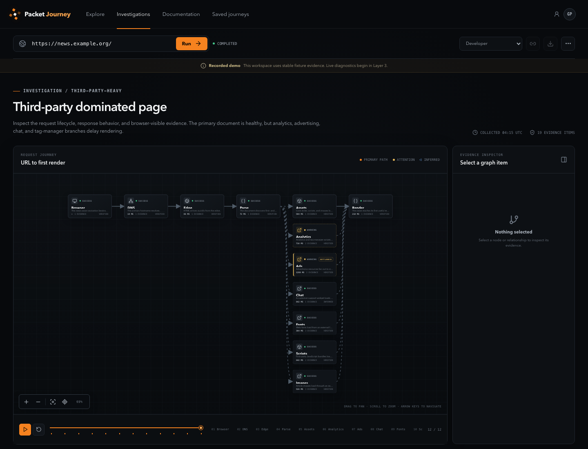

# Packet Journey

Packet Journey is an AI-assisted network investigation environment that reconstructs, visualizes, and diagnoses the path from a URL to a rendered webpage.

The project is being built in validated layers. Layers 1–4 are complete: a production-shaped frontend, an interactive journey graph, and a deterministic Cloudflare Worker investigation pipeline for DNS, certificate, redirects, HTTP, cache, and security evidence. Browser execution and AI are not represented as active features.



## Current product experience

- A cinematic, responsive landing page with URL intake and an animated-style request preview.
- Seven stable demo investigations with genuinely different request paths.
- A deterministic left-to-right graph with directed edges, stable parallel branches, cache return paths, redirect chains, and failure termination.
- Pointer and keyboard node/edge selection, pan, zoom, fit, reset, related-stage dimming, and responsive resize behavior.
- A synchronized timeline with playback, pause, restart, stage skipping, and progressive reveal.
- An evidence inspector for stages and relationships, including verified/inferred provenance, timestamps, related findings, and bottleneck status.
- Beginner, developer, and network-engineer explanation modes over one evidence model.
- Live network URL intake with stage-aware loading, structured retry/error states, and no fixture fallback.
- Bounded A, AAAA, CNAME, CAA, NS, MX, and sanitized TXT diagnostics with TTLs, CNAME reconstruction, address-policy results, and resolver-reported DNSSEC metadata.
- Independent certificate evidence with deterministic SAN coverage and validity checks; a clearly labeled Certificate Transparency fallback is used when a direct peer probe is unavailable.
- Manual redirect tracing, response status and timing, allowlisted headers, cache/security findings, and partial-result journeys.
- Deliberate loading, empty, invalid URL, blocked destination, missing investigation, TLS failure, and mobile states.

The seven seeded demonstrations remain stable recorded examples. Live workspaces are labeled **Live network evidence** and contain only facts returned by deterministic tools or limited, explicitly labeled inferences with provenance.

## Architecture

```mermaid
flowchart LR
    UI[React client] -->|POST /api/v1/investigations/http| W[Cloudflare Worker]
    W --> N[URL normalization + SSRF policy]
    N --> DNS[Cloudflare 1.1.1.1 DoH diagnostics]
    DNS --> TLS[Bounded peer probe or labeled CT fallback]
    TLS --> R[Manual redirect tracer]
    R --> H[Allowlisted headers + timing]
    H --> D[Deterministic cache/security rules]
    D --> M[Validated Investigation schema]
    M --> UI
    DEMO[Recorded examples] --> UI
```



The React client and Worker share strict TypeScript and Zod runtime contracts. The Worker never returns graph coordinates; a library-neutral client adapter derives graph nodes, relationships, primary/secondary paths, confidence, and bottlenecks. Cloudflare Workers performs bounded deterministic orchestration, with a native Rate Limiting binding protecting the endpoint. D1, R2, Durable Objects, Queues, Browser Rendering, Workers AI, AI Gateway, and Vectorize are not wired into Layer 4.

## Request lifecycle

The Layer 4 lifecycle is intake → normalization → DNS records and public-address validation → independent certificate evidence for relevant HTTPS hosts → bounded manual redirects → HTTP header/timing collection → deterministic DNS/TLS/cache/security findings → canonical investigation validation → adaptive rendering. Completed evidence is retained when a later DNS, certificate, redirect, or HTTP step fails. See [the pipeline design](./docs/investigation-pipeline.md).

## Local development

Requirements: Node.js 22+ and npm 10+.

```bash
npm install
npm run dev
```

`npm run dev` starts Vite on port 5173 and Wrangler on port 8787; Vite proxies `/api` to the Worker. Local development and tests require no Cloudflare credentials. Copy `.dev.vars.example` to `.dev.vars` only when overriding local variables. Limited unauthenticated Certificate Transparency lookup is suitable for evaluation; configure the optional Cert Spotter token for production use.

Useful split commands:

```bash
npm run dev:web
npm run dev:worker
npm run build:web
npm run build:worker
```

## Quality checks

```bash
npm run format
npm run typecheck
npm run lint
npm run test
npm run build
npm audit
```

The deterministic suite covers client and Worker URL handling, SSRF IP/hostname policy, DoH parsing, redirect chains and failures, header filtering, cache/security rules, infrastructure clues, canonical adaptation, API/CORS/error envelopes, graph behavior, accessibility interactions, and the seven recorded journeys. Main tests use mocked responses and do not require public Internet access.

## Deployment

`npm run build` builds the static client and runs a Wrangler Worker dry run. Deploy the client to a static host with SPA fallback, then deploy the Worker with:

```bash
npm run deploy:preview
npm run deploy:production
```

Set `VITE_API_BASE_URL` at frontend build time when the API is on another origin. Configure `CORS_ALLOWED_ORIGINS` on the Worker as a comma-separated exact allowlist for those frontend origins.

## Environment variables

- `VITE_API_BASE_URL` — optional public Worker origin; omitted for same-origin/proxied local requests.
- `ENVIRONMENT` — `development`, `preview`, `production`, or `test` label used in health output.
- `CORS_ALLOWED_ORIGINS` — optional comma-separated exact origin allowlist.
- `HTTP_HOP_TIMEOUT_MS` — optional 250–15,000 ms override; default 8,000 ms.
- `HTTP_OVERALL_TIMEOUT_MS` — optional 250–30,000 ms override; default 20,000 ms.
- `DNS_TIMEOUT_MS` — optional 250–10,000 ms per-host DNS diagnostic bound; default 5,000 ms.
- `CERTIFICATE_TIMEOUT_MS` — optional 250–10,000 ms per certificate mechanism; default 8,000 ms.
- `CERTSPOTTER_API_TOKEN` — optional SSLMate Cert Spotter token. Store it with `wrangler secret put CERTSPOTTER_API_TOKEN`; never expose it to the client.

No Cloudflare API token, storage binding, or AI model key is required for local Layer 4 development.

## Security considerations

Client URL validation is only a usability guard. The Worker independently rejects credentials, unsupported protocols, internal hostnames, private/reserved IPv4 and IPv6 ranges, IPv4-mapped bypasses, metadata addresses, and unsafe DNS answers. Every redirect is normalized and revalidated before following. Target bodies are never consumed, response headers use a non-sensitive allowlist, and time/redirect/header limits are explicit. See [the security model](./docs/security.md) for the remaining DNS-rebinding limitation.

## Design decisions

- Keep observations and conclusions separate; findings can cite evidence but cannot become evidence.
- Infer TypeScript types from runtime schemas to keep fixture, client, Worker, and persistence contracts aligned.
- Prefer token-driven CSS while the visual system is evolving.
- Show disabled future controls with their delivery layer instead of presenting placeholders as working features.
- Use deterministic seeded scenarios as a reliable portfolio/demo surface before live network behavior exists.
- Keep visualization state in a graph adapter and controller instead of contaminating the canonical investigation schema with coordinates or UI selection.
- Use a custom layered SVG layout for stable output, accessible HTML nodes, precise Packet Journey styling, and independent adapter/layout tests.
- Use Cloudflare's public DoH endpoint as a fail-closed hostname preflight while acknowledging that Workers cannot pin the later fetch to the preflight answer.
- Use minimal `GET` plus immediate body cancellation instead of relying on inconsistent `HEAD` support.
- Keep live HTTP results and recorded examples explicit; never silently substitute one for the other.
- Apply a coarse 20-request/minute, per-location/client-network Worker Rate Limiting binding before diagnostic work; do not treat it as identity or billing accounting.

## Known limitations

- DNS data is recursive resolver evidence, not an authoritative-traversal trace. `AD` records the resolver's authentication signal and is not a complete DNSSEC security verdict.
- A direct `node:tls` peer probe can be unavailable under Workers socket policy. The fallback is a Certificate Transparency issuance, not proof of the certificate used by the target HTTP fetch.
- Workers does not expose outbound fetch TCP time, TLS handshake time, cipher, ALPN, selected peer chain, origin-only time, or browser render timing.
- DoH preflight checks observed answers but cannot pin the target connection, so it reduces rather than eliminates DNS-rebinding risk.
- Some targets reject or treat data-center/Worker requests differently from browser traffic.
- AI commands, simulations, persistence, sharing, export, and authentication are not active.
- No D1, R2, Durable Objects, Queues, Browser Rendering, Workers AI, AI Gateway, or Vectorize bindings exist yet.
- Layout is optimized for directed acyclic request journeys. Defensive cyclic input rendering exists, but cycle-specific routing is not a Layer 2 feature.
- Very large graphs are fit as an overview and may require user zoom; semantic clustering is deferred until real browser traces establish its rules.

## Roadmap

The next milestone is Layer 5: browser investigation. It has not started. The remaining milestones are tracked in [the implementation plan](./docs/implementation-plan.md).

## Architecture and planning

- [Implementation plan](./docs/implementation-plan.md)
- [Architecture](./docs/architecture.md)
- [Investigation pipeline](./docs/investigation-pipeline.md)
- [Security model](./docs/security.md)
- [AI design](./docs/ai-design.md)
- [Data model](./docs/data-model.md)
- [Counterfactual engine](./docs/counterfactual-engine.md)
- [Journey visualization](./docs/journey-visualization.md)
- [HTTP diagnostics](./docs/http-diagnostics.md)
- [Cloudflare runtime](./docs/cloudflare-runtime.md)
- [DNS and TLS diagnostics](./docs/dns-tls-diagnostics.md)
