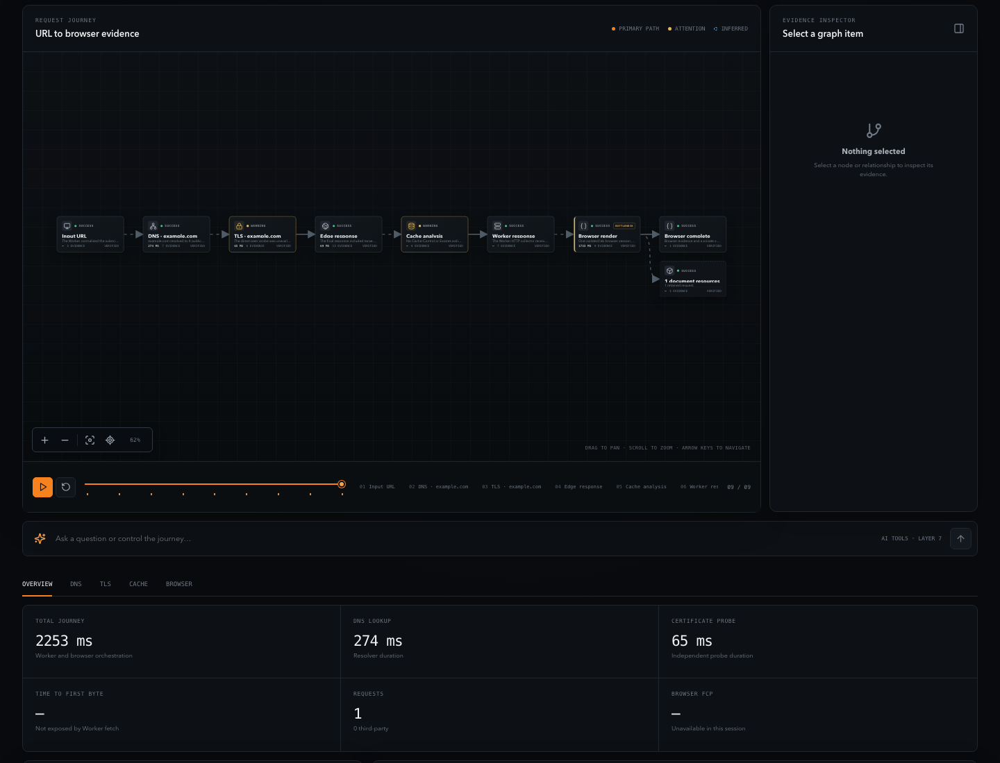
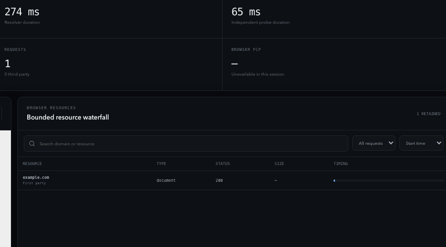
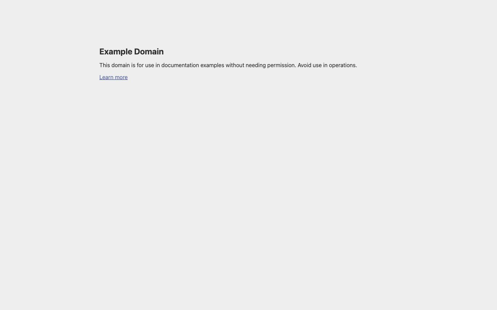
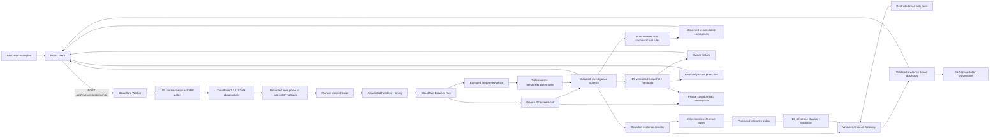

# Packet Journey

Packet Journey is an AI-assisted network investigation environment that reconstructs, visualizes, and diagnoses the path from a URL to a rendered webpage.

Layers 1–9 are complete: the Cloudflare investigation pipeline, evidence-grounded AI investigator, deterministic counterfactual debugger, D1-backed history, and versioned authoritative reference retrieval support measured journeys, explicitly simulated comparisons, and reproducible read-only reports. Deterministic tools collect facts; Vectorize retrieves explanatory standards; AI interprets both without turning documentation into site evidence.



| Resource investigation                                                    | Rendered-page evidence                                                                           |
| ------------------------------------------------------------------------- | ------------------------------------------------------------------------------------------------ |
|  |  |

## Current product experience

- A cinematic, responsive landing page with URL intake and an animated-style request preview.
- Seven stable demo investigations with genuinely different request paths.
- A deterministic left-to-right graph with directed edges, stable parallel branches, cache return paths, redirect chains, and failure termination.
- Pointer and keyboard node/edge selection, pan, zoom, fit, reset, related-stage dimming, and responsive resize behavior.
- A synchronized timeline with playback, pause, restart, stage skipping, and progressive reveal.
- An evidence inspector for stages and relationships, including verified/inferred provenance, timestamps, related findings, and bottleneck status.
- Beginner, developer, and network-engineer explanation modes over one evidence model.
- Live network URL intake with stage-aware loading, structured retry/error states, and no fixture fallback.
- Bounded A, AAAA, CNAME, CAA, NS, MX, and sanitized TXT diagnostics with TTLs, CNAME reconstruction, address-policy results, and resolver-reported DNSSEC metadata.
- Independent certificate evidence with deterministic SAN coverage and validity checks; a clearly labeled Certificate Transparency fallback is used when a direct peer probe is unavailable.
- Manual redirect tracing, response status and timing, allowlisted headers, cache/security findings, and partial-result journeys.
- A real isolated Cloudflare Browser Run session with final browser URL, page title, document status, navigation/paint milestones, bounded resources, failures, console evidence, and cautious third-party classification.
- Private R2 screenshot storage with opaque IDs, 24-hour access expiry, a read-only Worker route, secure image headers, and deliberate loading/failure states.
- A searchable, sortable resource waterfall and evidence-driven browser/resource branches in the existing graph and timeline.
- Deliberate loading, empty, invalid URL, blocked destination, missing investigation, TLS failure, and mobile states.
- A compact one-question AI investigator with deterministic suggestions, strict structured output, cited evidence navigation, explicit uncertainty, prioritized actions, graph emphasis, cancellation, and clear fixture/model labels.
- Beginner, Developer, and Network Engineer AI depth over the same evidence, with deterministic findings preserved as the authoritative rule output.
- Eight registered counterfactual rules with side-by-side observed/simulated graphs, metric provenance, explicit assumptions, synchronized controls, bounded in-memory history, and JSON export.
- D1-backed save, history, filtering, pagination, rename, and delete flows for versioned canonical evidence snapshots.
- Read-only share reports with 256-bit opaque bearer tokens, hash-only token storage, optional expiry/revocation, access metadata, and explicit AI/simulation/screenshot inclusion controls.
- Saved screenshots promoted into a private R2 namespace with owner/share authorization and a documented 30-day application retention bound.
- Evidence-only and evidence-plus-reference explanation modes over one unchanged investigation, with one metadata-filtered Vectorize query and explicit unavailable/no-result states.
- A reviewed 17-source corpus from Cloudflare, IETF, MDN, OWASP, web.dev, and CA/Browser Forum, embedded with Workers AI and resolved through D1 before prompting.
- Frozen citation cards and a model/index/corpus/retrieval provenance panel in live, saved, and shared explanations.

The seven seeded demonstrations remain stable recorded examples. Live workspaces are labeled **Live network evidence** and contain only facts returned by deterministic tools or limited, explicitly labeled inferences with provenance.

Example bounded diagnosis:

> **Likely:** The recorded origin stage is the largest measured duration in this journey. That supports prioritizing origin-path investigation, but it does not reveal whether application code, a database, or another internal dependency caused the delay. Evidence: `origin-e1`.

The same reference selects the graph stage and inspector evidence. The deterministic finding remains unchanged beside the AI interpretation.

## Architecture



The React client and Worker share strict TypeScript and Zod runtime contracts. Workers performs bounded diagnostics, retrieval/AI orchestration, and persistence authorization; Browser Run collects isolated page evidence; Vectorize searches versioned embeddings; D1 is the evidence, reference-content, model-version, retrieval, and frozen-citation provenance ledger; R2 stores screenshot bytes; Workers AI embeds controlled queries and interprets validated evidence/references; AI Gateway provides text-model observability/routing. The model has no arbitrary fetch or code tool.

## Request lifecycle

The deterministic lifecycle remains intake → normalization → DNS/public-address policy → certificate evidence → manual redirects → HTTP evidence → isolated Browser Run → private R2 screenshot → deterministic findings → canonical validation. A separate diagnosis request interprets bounded evidence. Counterfactuals run afterward as pure client-side transformations of an immutable investigation; they perform no network request and label every derived value `SIMULATED · NOT MEASURED`.

## Local development

Requirements: Node.js 22+ and npm 10+.

```bash
npm install
npm run db:migrate:local
npm run dev
```

`npm run db:migrate:local` applies ordered SQL migrations to the local D1 database. `npm run dev` then starts Vite on port 5173 and a credential-free local Worker on port 8787 using `wrangler.local.jsonc`; Vite proxies `/api` to it. Local D1 and R2 data live in Wrangler's ignored local state. The local config deliberately omits the always-remote `AI` binding and enables visibly labeled deterministic fixture output. Use `npm run dev:worker:ai` with fixture mode disabled for the production-shaped AI binding when Wrangler authentication/runtime access is available. No model API key is used.

There are two distinct AI development modes:

```bash
# Credential-free deterministic fixture mode (recommended for routine local work)
npm run dev

# Real Workers AI mode (run these from the repository in separate terminals)
npx wrangler login --use-keyring
npx wrangler whoami
npm run dev:web
npm run dev:worker:ai
```

`wrangler login` opens Cloudflare's OAuth flow; do it only when testing real remote bindings or deploying. The running application does not use a Cloudflare API key. Workers AI uses the `AI` binding and account identity established by Wrangler. Because Workers AI and Vectorize are remote-only bindings, real authoritative-reference mode also requires the versioned Vectorize index and ingested corpus described in [Controlled reference ingestion](./docs/reference-ingestion.md). Until that operator setup is complete, use evidence-only mode for a real-model smoke or the default fixture mode for the complete local flow.

Useful split commands:

```bash
npm run dev:web
npm run dev:worker
npm run dev:worker:ai
npm run build:web
npm run build:worker
npm run db:reset:local
npm run test:retrieval
```

## Quality checks

```bash
npm run format
npm run typecheck
npm run lint
npm run test
npm run build
npm audit
```

The deterministic suite covers client and Worker URL handling, SSRF policy, DNS/TLS/HTTP collection, Browser Run lifecycle/cleanup, browser navigation safety, resource classification/bounds, performance and console normalization, R2 storage/retrieval, browser findings, canonical adaptation, API/CORS/error envelopes, graph behavior, accessibility interactions, persisted serialization/integrity, prepared ownership boundaries, token handling, and recorded journeys. Main tests use mocked responses and do not require public Internet access.

## Deployment

`npm run build` builds the static client and runs a Wrangler Worker dry run. Deploy the client to a static host with SPA fallback, then deploy the Worker with:

```bash
npm run deploy:preview
npm run deploy:production
```

Set `VITE_API_BASE_URL` at frontend build time when the API is on another origin. Configure `CORS_ALLOWED_ORIGINS` on the Worker as a comma-separated exact allowlist for those frontend origins.

Before the first preview/production Worker deployment, create the D1 databases and private R2 buckets named in `wrangler.jsonc`, then record the account-specific D1 database IDs in deployment configuration. Apply `npm run db:migrate:preview` before preview deployment and `npm run db:migrate:production` before production deployment. Configure a one-day R2 lifecycle rule for `browser-screenshots/` and a 30-day rule for `saved-artifacts/`. Browser Run must be enabled for the account. Wrangler CLI authentication is deployment tooling; the application never reads a Cloudflare API token.

Preview deployment is intentionally not automatic from local development. It requires provisioned account resources, valid Wrangler authentication, migrations applied to the preview database, and the account-specific binding IDs.

## Environment variables

- `VITE_API_BASE_URL` — optional public Worker origin; omitted for same-origin/proxied local requests.
- `ENVIRONMENT` — `development`, `preview`, `production`, or `test` label used in health output.
- `CORS_ALLOWED_ORIGINS` — optional comma-separated exact origin allowlist.
- `HTTP_HOP_TIMEOUT_MS` — optional 250–15,000 ms override; default 8,000 ms.
- `HTTP_OVERALL_TIMEOUT_MS` — optional 250–30,000 ms override; default 20,000 ms.
- `DNS_TIMEOUT_MS` — optional 250–10,000 ms per-host DNS diagnostic bound; default 5,000 ms.
- `CERTIFICATE_TIMEOUT_MS` — optional 250–10,000 ms per certificate mechanism; default 8,000 ms.
- `CERTSPOTTER_API_TOKEN` — optional SSLMate Cert Spotter token. Store it with `wrangler secret put CERTSPOTTER_API_TOKEN`; never expose it to the client.
- `BROWSER_ENABLED` — `true` or `false`; disables Browser Run cleanly while preserving the Layer 4 HTTP journey.
- `AI_ENABLED` — disables only the AI endpoint when `false`.
- `AI_FIXTURE_MODE` — deterministic local/test answers only; ignored outside development/test.
- `AI_GATEWAY_ID` — AI Gateway identifier, default `default`.
- `AI_MODEL` — configured model-registry key, default `granite-micro` for bounded structured diagnosis latency.
- `AI_PLANNER_MODEL` — bounded tool-selection model, default `granite-micro`.
- `AI_FALLBACK_MODEL`, `AI_MAX_REQUESTS`, `AI_MAX_TOOL_ROUNDS`, `AI_MAX_INPUT_CHARS`, `AI_MAX_OUTPUT_CHARS`, `AI_MAX_OUTPUT_TOKENS`, `AI_TIMEOUT_MS` — optional bounded AI controls; model calls default to a 1,400-token output cap and 45-second timeout.
- `TECHNICAL_REFERENCES` — versioned Vectorize binding for `packet-journey-references-v1`; absent from credential-free local fixture configuration.
- `REFERENCE_INDEX_VERSION`, `REFERENCE_EMBEDDING_MODEL`, `REFERENCE_CORPUS_VERSION`, `REFERENCE_RETRIEVAL_VERSION` — independent, non-secret provenance contracts.

`DB`, `BROWSER`, `BROWSER_ARTIFACTS`, `AI`, `TECHNICAL_REFERENCES`, and the Rate Limiting bindings are typed Wrangler bindings, not secrets. Ingestion alone accepts a scoped Cloudflare API token through its operator process; application code does not read one.

## Security considerations

Client URL validation is only a usability guard. The Worker independently rejects credentials, unsupported protocols, internal hostnames, private/reserved IPv4 and IPv6 ranges, IPv4-mapped bypasses, metadata addresses, and unsafe DNS answers. Every HTTP and browser destination is revalidated before connection where the runtimes permit interception. Browser contexts contain no user credentials or cookies, target Worker bodies are never consumed, output is bounded and sanitized, and R2 has no public bucket or arbitrary-key route. See [the security model](./docs/security.md) for the remaining DNS-rebinding limitation and artifact-link boundary.

## Design decisions

- Keep observations and conclusions separate; findings can cite evidence but cannot become evidence.
- Infer TypeScript types from runtime schemas to keep fixture, client, Worker, and persistence contracts aligned.
- Prefer token-driven CSS while the visual system is evolving.
- Show disabled future controls with their delivery layer instead of presenting placeholders as working features.
- Use deterministic seeded scenarios as a reliable portfolio/demo surface before live network behavior exists.
- Keep visualization state in a graph adapter and controller instead of contaminating the canonical investigation schema with coordinates or UI selection.
- Use a custom layered SVG layout for stable output, accessible HTML nodes, precise Packet Journey styling, and independent adapter/layout tests.
- Use Cloudflare's public DoH endpoint as a fail-closed hostname preflight while acknowledging that Workers cannot pin the later fetch to the preflight answer.
- Use minimal `GET` plus immediate body cancellation instead of relying on inconsistent `HEAD` support.
- Keep live HTTP results and recorded examples explicit; never silently substitute one for the other.
- Apply a coarse 20-request/minute, per-location/client-network Worker Rate Limiting binding before diagnostic work; do not treat it as identity or billing accounting.
- Run Browser Run only for a verified final document and protect it with a stricter three-request/minute abuse guard.
- Keep screenshot bytes out of canonical JSON and behind an opaque, expiring, Worker-mediated R2 read route.
- Defer Queues until measured production latency demonstrates that the bounded synchronous browser contract is unsuitable.
- Keep model IDs in one registry, cap context well below the documented window, skip Gateway caching, and runtime-validate every model claim/reference before rendering.
- Return an evidence-guarded inconclusive answer without inference when the selected investigation has no relevant evidence.
- Keep counterfactual execution in a fixed, versioned TypeScript rule registry; reject arbitrary expressions and mark unsupported downstream metrics unavailable.
- Keep Vectorize embeddings and compact metadata separate from normalized D1 chunks; resolve and validate every match before prompting.
- Treat D1 as a reproducibility ledger for evidence, model, retrieval, versions, and frozen citations—not a customer dashboard database.

## Known limitations

- DNS data is recursive resolver evidence, not an authoritative-traversal trace. `AD` records the resolver's authentication signal and is not a complete DNSSEC security verdict.
- A direct `node:tls` peer probe can be unavailable under Workers socket policy. The fallback is a Certificate Transparency issuance, not proof of the certificate used by the target HTTP fetch.
- Workers fetch does not expose outbound TCP time, TLS handshake time, cipher, ALPN, selected peer chain, or origin-only time. Browser metrics come from a separate isolated Browser Run session.
- DoH preflight checks observed answers but cannot pin the target connection, so it reduces rather than eliminates DNS-rebinding risk.
- Some targets reject or treat data-center/Worker requests differently from browser traffic.
- Browser timings are one lab observation, not field performance; cross-origin timing policy and caching can make transfer bytes unavailable.
- Browser request interception rechecks DNS but cannot pin Chromium's later connection to the checked answer, leaving a documented rebinding gap.
- Live screenshot links are short-lived bearer references. Saved screenshot routes additionally require the anonymous owner cookie or an active share token with screenshot inclusion enabled.
- AI output can still be semantically imperfect despite structural/reference validation; the UI exposes confidence and uncertainty rather than presenting it as fact.
- Snapshot SHA-256 hashes detect unexpected stored-data changes but are not signatures and do not prove that a client-submitted investigation originally came from Packet Journey.
- Anonymous installation ownership is deliberately not authentication. Clearing cookies or changing browsers loses owner access, and there is no account recovery or cross-device history.
- Public reports are bearer links. Tokens are high-entropy and stored only as hashes, but anyone who receives a live link can read its bounded projection until it expires or is revoked.
- D1 has bounded snapshot/output limits; large screenshot bytes remain in R2. Saved artifact expiry is enforced on reads, while bucket lifecycle rules provide physical deletion.
- Live Vectorize depends on provisioned account resources; credential-free development uses an explicit fixture corpus and never silently falls back in production.
- Durable Objects, Queues, AI Search, full authentication, organizations, live viewers, and collaborative editing remain unimplemented.
- Layout is optimized for directed acyclic request journeys. Defensive cyclic input rendering exists, but cycle-specific routing is not a Layer 2 feature.
- Very large graphs are fit as an overview and may require user zoom; semantic clustering is deferred until real browser traces establish its rules.

## Roadmap

Layer 9 is complete. Layer 10 has not started. Durable Objects remain deferred until a concrete real-time coordination requirement exists; Queues, AI Search, full authentication, organizations, and collaboration remain absent. The remaining milestone is tracked in [the implementation plan](./docs/implementation-plan.md).

## Architecture and planning

- [Implementation plan](./docs/implementation-plan.md)
- [Architecture](./docs/architecture.md)
- [Investigation pipeline](./docs/investigation-pipeline.md)
- [Security model](./docs/security.md)
- [AI design](./docs/ai-design.md)
- [AI investigation](./docs/ai-investigation.md)
- [AI trust boundary](./docs/ai-trust-boundary.md)
- [AI evaluation](./docs/ai-evaluation.md)
- [Data model](./docs/data-model.md)
- [Counterfactual engine](./docs/counterfactual-engine.md)
- [Counterfactual debugging contract](./docs/counterfactual-debugging.md)
- [Counterfactual rules](./docs/counterfactual-rules.md)
- [Counterfactual evaluation](./docs/counterfactual-evaluation.md)
- [Journey visualization](./docs/journey-visualization.md)
- [HTTP diagnostics](./docs/http-diagnostics.md)
- [Cloudflare runtime](./docs/cloudflare-runtime.md)
- [DNS and TLS diagnostics](./docs/dns-tls-diagnostics.md)
- [Browser investigation](./docs/browser-investigation.md)
- [Browser artifacts](./docs/browser-artifacts.md)
- [Persistence architecture](./docs/persistence.md)
- [D1 schema and migrations](./docs/d1-schema.md)
- [Share-link security](./docs/share-links.md)
- [Data retention](./docs/data-retention.md)
- [Reference retrieval](./docs/reference-retrieval.md)
- [Reference corpus](./docs/reference-corpus.md)
- [Reference ingestion](./docs/reference-ingestion.md)
- [Retrieval provenance](./docs/retrieval-provenance.md)
- [Retrieval evaluation](./docs/retrieval-evaluation.md)
