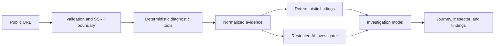

# Packet Journey

Packet Journey is an AI-assisted network investigation environment that reconstructs, visualizes, and diagnoses the path from a URL to a rendered webpage.

The project is being built in validated layers. Layer 1 is complete: a production-shaped frontend backed by realistic seeded investigation data. Live diagnostics are not represented as complete until their corresponding milestones pass validation.

## Current product experience

- A cinematic, responsive landing page with URL intake and an animated-style request preview.
- Seven stable demo investigations with genuinely different request paths.
- A selectable journey workspace with an evidence inspector, timeline, metrics, and evidence-linked findings.
- Beginner, developer, and network-engineer explanation modes over one evidence model.
- Deliberate loading, empty, invalid URL, missing investigation, TLS failure, and mobile states.

All current protocol evidence is marked as recorded fixture data. Live HTTP collection begins in Layer 3 after the full interactive graph is validated in Layer 2.

## Architecture



The browser UI is React with strict TypeScript and Zod runtime schemas. The planned backend uses Cloudflare Workers for orchestration, then adds Browser Rendering, Queues, Durable Objects, D1, and R2 only where their responsibilities become necessary. Workers AI is downstream of evidence and routed through AI Gateway.

## Request lifecycle

The target lifecycle is intake → normalization → public-network safety validation → deterministic HTTP/DNS/TLS/browser tools → normalized evidence → deterministic findings → optional AI explanation → adaptive journey rendering. See [the pipeline design](./docs/investigation-pipeline.md) for failure and partial-result behavior.

## Local development

Requirements: Node.js 22+ and npm 10+.

```bash
npm install
npm run dev
```

Vite prints the local development URL. No environment variables or Cloudflare credentials are required for Layer 1.

## Quality checks

```bash
npm run format
npm run typecheck
npm run lint
npm run test
npm run build
npm audit
```

Layer 1 includes URL normalization, schema integrity, major journey-shape rendering, route, form validation, and evidence-selection tests. Future network tests will use recorded fixtures instead of depending on live websites.

## Deployment

`npm run build` produces the static client in `dist/`. It can be deployed to Cloudflare Pages with SPA fallback to `index.html`. Worker deployment configuration will be added with Layer 3; there is intentionally no nonfunctional Worker manifest today.

## Environment variables

Layer 1 has none. Later milestones will document and validate Cloudflare binding names and model configuration without placing credentials in the client bundle.

## Security considerations

Client URL validation is a usability guard, not an SSRF defense. Live investigation will not ship until the Worker validates schemes, hostnames, resolved IPs, every redirect target, response limits, and timeouts as specified in [the security model](./docs/security.md). URLs containing credentials and non-HTTP(S) schemes are already rejected at intake.

## Design decisions

- Keep observations and conclusions separate; findings can cite evidence but cannot become evidence.
- Infer TypeScript types from runtime schemas to keep fixture, client, Worker, and persistence contracts aligned.
- Prefer token-driven CSS while the visual system is evolving.
- Show disabled future controls with their delivery layer instead of presenting placeholders as working features.
- Use deterministic seeded scenarios as a reliable portfolio/demo surface before live network behavior exists.

## Known limitations

- No live network, DNS, TLS, or browser collection yet.
- The current journey preview is selectable and responsive but does not yet provide zoom, pan, spatial branching, or packet animation.
- AI commands, simulations, persistence, sharing, export, and authentication are not active.
- Cloudflare bindings and deployment automation begin only when a working backend requires them.

## Roadmap

The next milestone is Layer 2: the adaptive journey visualization, including graph layout, real branches, zoom and pan, animated request movement, keyboard traversal, reduced motion, and rendering tests for every seeded shape. The remaining milestones are tracked in [the implementation plan](./docs/implementation-plan.md).

## Architecture and planning

- [Implementation plan](./docs/implementation-plan.md)
- [Architecture](./docs/architecture.md)
- [Investigation pipeline](./docs/investigation-pipeline.md)
- [Security model](./docs/security.md)
- [AI design](./docs/ai-design.md)
- [Data model](./docs/data-model.md)
- [Counterfactual engine](./docs/counterfactual-engine.md)
