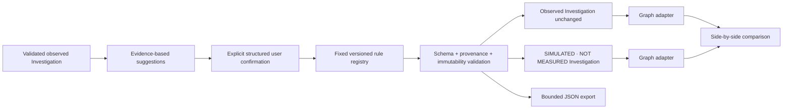

# Architecture

Packet Journey separates collection, interpretation, and presentation.

1. The React client submits a URL to the versioned Cloudflare Worker API.
2. The Worker validates the request, normalizes the URL, collects bounded recursive DNS evidence, and applies one shared public-address policy before any target fetch or certificate probe.
3. A typed orchestrator reconstructs CNAMEs, records resolver DNSSEC metadata, selects at most three meaningful hostnames, and inspects HTTPS certificate evidence through a restricted peer probe with a Certificate Transparency fallback.
4. A bounded state machine manually fetches and revalidates each redirect destination, records allowlisted response headers, times Worker subrequests, and cancels every unused body.
5. After a final public document exists, a typed Browser Run client creates one isolated page, revalidates intercepted browser destinations, and collects bounded navigation, resource, console, failure, and screenshot evidence.
6. Screenshot bytes go to private R2; only an opaque, expiring, Worker-mediated artifact reference enters the investigation JSON.
7. Pure deterministic modules create evidence-linked DNS, TLS, cache, security-header, redirect, infrastructure, and browser findings.
8. The Worker adapter creates and runtime-validates the canonical investigation model, including resource branches and terminal/partial browser states.
9. The React client renders the same model as a graph, timeline, evidence inspector, screenshot panel, waterfall, and findings. Recorded examples enter at this same boundary but remain visibly labeled.
10. A separate diagnosis endpoint validates a submitted canonical investigation, selects bounded evidence, optionally executes approved read-only views, and sends structured requests through the Workers AI binding and AI Gateway.
11. Cross-reference validation rejects invented evidence, findings, stages, graph mutations, and overconfident unsupported conclusions before the assistant panel receives output.
12. A pure client-side counterfactual registry clones one validated observed investigation, applies exactly one fixed rule, validates provenance and immutability, and returns a separately labeled simulated investigation plus changes, assumptions, and metric decisions.
13. The comparison workspace adapts both investigations independently into the existing graph/layout boundary; no simulation coordinate or UI state enters the canonical schema.

## Layer 7 counterfactual boundary

The engine lives in shared pure TypeScript and runs in the browser for Layer 7. It has no Worker route, fetch capability, expression evaluator, R2 access, or persistence. Histories are limited to five results in component memory. The optional AI panel receives only a completed canonical simulation; it cannot choose or execute a rule.

## Layer 5 runtime boundary

```mermaid
flowchart LR
    C[React client] -->|validated JSON| API[Cloudflare Worker router]
    API --> URL[Canonical URL normalizer]
    URL --> DNS[Typed Cloudflare DoH client]
    DNS --> SSRF[Shared IP and SSRF policy]
    SSRF --> CERT[Restricted peer certificate probe]
    CERT -->|unavailable| CT[Fixed Cert Spotter CT API]
    CERT --> TRACE[Manual redirect tracer]
    CT --> TRACE
    TRACE --> HEADERS[Allowlisted headers + hop timing]
    HEADERS --> BROWSER[Cloudflare Browser Run]
    BROWSER --> BE[Bounded browser evidence]
    BROWSER --> R2[Private R2 screenshot]
    R2 --> ART[Opaque artifact metadata]
    HEADERS --> RULES[DNS, TLS, cache, security, infrastructure rules]
    BE --> BRULES[Deterministic browser rules]
    RULES --> ADAPTER[Investigation adapter + Zod validation]
    BRULES --> ADAPTER
    ART --> ADAPTER
    ADAPTER --> C
    TRACE -->|partial error| ADAPTER
    BROWSER -->|partial or unavailable| ADAPTER
    ADAPTER --> SELECT[Bounded AI evidence selector]
    SELECT --> WAI[Workers AI through AI Gateway]
    WAI <--> TOOLS[Restricted read-only tool registry]
    WAI --> VALIDATE[Schema + evidence-reference validation]
    VALIDATE --> AIPANEL[AI panel + graph emphasis]
```

The Worker is divided into routing/environment/error/logging, `security/`, `diagnostics/`, `browser/`, `artifacts/`, `findings/`, and `adapters/` modules. No Worker module emits graph-library types. Browser Run, R2, and the React UI communicate only through canonical diagnostic/evidence contracts. The API response passes the same `Investigation` runtime schema as fixtures before it reaches the client.

## Client visualization boundary

The canonical investigation model does not contain canvas positions or component state. A pure graph adapter converts stages and connections into library-neutral nodes and classified relationships, determines the primary path, joins related findings by evidence ID, and identifies the dominant measured duration. A deterministic layered layout then assigns stable left-to-right ranks and branch lanes.

The SVG canvas owns only viewport interaction. A shared journey controller synchronizes graph selection, timeline position, progressive reveal, playback, and reduced-motion behavior. The inspector reads the selected adapter node or edge and never mutates evidence.

This separation keeps future Worker responses independent of rendering technology and lets graph generation and layout be tested without a browser. See [journey-visualization.md](./journey-visualization.md).

Cloudflare services are introduced only with a concrete responsibility. Workers provides APIs and orchestration; Browser Run provides isolated Chromium evidence; R2 stores screenshots; Workers AI interprets bounded evidence; AI Gateway supplies inference observability/routing with caching disabled; native Rate Limiting bindings protect diagnostic and AI work. Cloudflare DoH supplies resolver evidence, and SSLMate Cert Spotter remains a narrowly scoped certificate fallback. Queues, Durable Objects, D1, Vectorize, identity, and collaboration remain unimplemented.

See [ai-investigation.md](./ai-investigation.md), [ai-trust-boundary.md](./ai-trust-boundary.md), [browser-investigation.md](./browser-investigation.md), [browser-artifacts.md](./browser-artifacts.md), [http-diagnostics.md](./http-diagnostics.md), [dns-tls-diagnostics.md](./dns-tls-diagnostics.md), [cloudflare-runtime.md](./cloudflare-runtime.md), and [implementation-plan.md](./implementation-plan.md).
