# Architecture

Packet Journey separates collection, interpretation, and presentation.

1. The React client submits a URL to the versioned Cloudflare Worker API.
2. The Worker validates the request, normalizes the URL, collects bounded recursive DNS evidence, and applies one shared public-address policy before any target fetch or certificate probe.
3. A typed orchestrator reconstructs CNAMEs, records resolver DNSSEC metadata, selects at most three meaningful hostnames, and inspects HTTPS certificate evidence through a restricted peer probe with a Certificate Transparency fallback.
4. The existing bounded state machine manually fetches and revalidates each redirect destination, records allowlisted response headers, times Worker subrequests, and cancels every unused body.
5. Pure deterministic modules create evidence-linked DNS, TLS, cache, security-header, redirect, and infrastructure findings.
6. The Worker adapter creates and runtime-validates the canonical investigation model, including terminal error stages for partial results.
7. The React client renders the same model as a graph, timeline, evidence inspector, and findings. Recorded examples enter at this same boundary but remain visibly labeled.

## Layer 4 runtime boundary

```mermaid
flowchart LR
    C[React client] -->|validated JSON| API[Cloudflare Worker router]
    API --> URL[Canonical URL normalizer]
    URL --> DNS[Typed Cloudflare DoH client]
    DNS --> SSRF[Shared IP and SSRF policy]
    SSRF --> CERT[Restricted peer certificate probe]
    CERT -->|unavailable| CT[Fixed Cert Spotter CT API]
    CERT --> TRACE[Manual redirect tracer]
    CT --> TRACE
    TRACE --> HEADERS[Allowlisted headers + hop timing]
    HEADERS --> RULES[DNS, TLS, cache, security, infrastructure rules]
    RULES --> ADAPTER[Investigation adapter + Zod validation]
    ADAPTER --> C
    TRACE -->|partial error| ADAPTER
```

The Worker is divided into routing/environment/error/logging, `security/`, `diagnostics/`, `findings/`, and `adapters/` modules. No module emits graph-library types. The API response passes the same `Investigation` runtime schema as fixtures before it reaches the client.

## Client visualization boundary

The canonical investigation model does not contain canvas positions or component state. A pure graph adapter converts stages and connections into library-neutral nodes and classified relationships, determines the primary path, joins related findings by evidence ID, and identifies the dominant measured duration. A deterministic layered layout then assigns stable left-to-right ranks and branch lanes.

The SVG canvas owns only viewport interaction. A shared journey controller synchronizes graph selection, timeline position, progressive reveal, playback, and reduced-motion behavior. The inspector reads the selected adapter node or edge and never mutates evidence.

This separation keeps future Worker responses independent of rendering technology and lets graph generation and layout be tested without a browser. See [journey-visualization.md](./journey-visualization.md).

Cloudflare services are introduced only with a concrete responsibility. Layer 4 uses Workers for the API runtime, observability logs, deterministic orchestration, outbound HTTP/DoH calls, a restricted `node:tls` client attempt, and a native Rate Limiting binding. Cloudflare's public 1.1.1.1 DoH endpoint supplies both safety and displayed resolver evidence. SSLMate Cert Spotter is a narrowly scoped external fallback when Workers cannot expose a peer certificate; only the prevalidated hostname is sent, and its output is labeled CT issuance evidence. Browser Rendering, Queues, Durable Objects, D1, R2, AI Gateway, Workers AI, and Vectorize remain unimplemented.

See [http-diagnostics.md](./http-diagnostics.md), [dns-tls-diagnostics.md](./dns-tls-diagnostics.md), [cloudflare-runtime.md](./cloudflare-runtime.md), and [implementation-plan.md](./implementation-plan.md).
