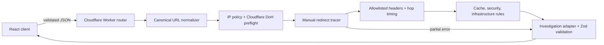

# Architecture

Packet Journey separates collection, interpretation, and presentation.

1. The React client submits a URL to the versioned Cloudflare Worker API.
2. The Worker validates the request, normalizes the URL, and enforces its public-network policy before any target fetch.
3. A bounded state machine manually fetches and revalidates each redirect destination, records allowlisted response headers, times Worker subrequests, and cancels every unused body.
4. Pure deterministic modules parse cache directives, check browser-facing security headers, and derive cautious infrastructure clues.
5. The Worker adapter creates and runtime-validates the canonical investigation model, including terminal error stages for partial results.
6. The React client renders the same model as a graph, timeline, evidence inspector, and findings. Recorded examples enter at this same boundary but remain visibly labeled.

## Layer 3 runtime boundary

The Worker is divided into routing/environment/error/logging, `security/`, `diagnostics/`, `findings/`, and `adapters/` modules. No module emits graph-library types. The API response passes the same `Investigation` runtime schema as fixtures before it reaches the client.

## Client visualization boundary

The canonical investigation model does not contain canvas positions or component state. A pure graph adapter converts stages and connections into library-neutral nodes and classified relationships, determines the primary path, joins related findings by evidence ID, and identifies the dominant measured duration. A deterministic layered layout then assigns stable left-to-right ranks and branch lanes.

The SVG canvas owns only viewport interaction. A shared journey controller synchronizes graph selection, timeline position, progressive reveal, playback, and reduced-motion behavior. The inspector reads the selected adapter node or edge and never mutates evidence.

This separation keeps future Worker responses independent of rendering technology and lets graph generation and layout be tested without a browser. See [journey-visualization.md](./journey-visualization.md).

Cloudflare services are introduced only with a concrete responsibility. Layer 3 uses Workers for the API runtime, observability logs, outbound HTTP fetches, bounded orchestration, and a native Rate Limiting binding at the investigation endpoint; it also calls Cloudflare's public 1.1.1.1 DoH endpoint for a defensive hostname preflight. Browser Rendering, Queues, Durable Objects, D1, R2, AI Gateway, Workers AI, and Vectorize are future decisions and have no current binding.

See [http-diagnostics.md](./http-diagnostics.md), [cloudflare-runtime.md](./cloudflare-runtime.md), and [implementation-plan.md](./implementation-plan.md).
