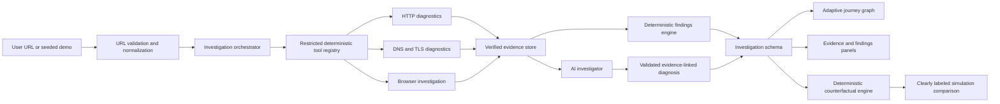

# Packet Journey implementation plan

## Product strategy

Packet Journey will be delivered as ten stable milestones. Each milestone must pass formatting, lint, strict type checking, tests, a production build, and a manual user-flow check before the next begins. Product surfaces may describe later capabilities, but unfinished behavior must be labeled as preview or unavailable.

## Proposed directory structure

```text
PacketJourney/
├── src/
│   ├── app/                    # Application shell, routing, route-level views
│   ├── components/             # Shared presentational components
│   │   ├── icons/
│   │   └── ui/
│   ├── data/                   # Seeded, validated demo investigations
│   ├── features/
│   │   └── investigation/      # Investigation domain UI and state
│   ├── lib/                    # Cross-cutting utilities and validation
│   ├── styles/                 # Design tokens and global styles
│   └── test/                   # Test setup and shared test utilities
│   ├── worker/                 # Layer 3+ Cloudflare Worker entry and services
│   │   ├── diagnostics/        # Small deterministic HTTP, DNS, and TLS tools
│   │   ├── findings/           # Evidence-linked deterministic rules
│   │   ├── adapters/           # Diagnostic results to shared investigation schema
│   │   └── security/           # URL, IP, redirect, timeout, and SSRF policy
├── packages/
│   ├── investigation-schema/   # Shared runtime schemas and TypeScript types
│   └── simulation/             # Layer 8 deterministic simulation engine
├── fixtures/                   # Recorded network and browser test fixtures
├── docs/
└── public/
```

Layer 1 keeps shared schemas in `src/features/investigation/schema.ts`. They move into the package boundary when the Worker is introduced, avoiding premature workspace complexity.

## Data flow



In Layer 1, the orchestrator boundary is represented by seeded mock investigations. The interface consumes the same schema intended for live results.

## Layer-by-layer milestone checklist

- [x] Layer 1 — Product foundation
- [x] Layer 2 — Adaptive journey visualization
- [x] Layer 3 — Deterministic HTTP investigation and SSRF-safe fetch
- [x] Layer 4 — DNS and TLS investigation
- [x] Layer 5 — Browser investigation
- [x] Layer 6 — Evidence-grounded AI investigation
- [x] Layer 7 — Deterministic counterfactual debugging
- [ ] Layer 8 — D1-backed investigation history and shareable reports
- [ ] Layer 9 — Persistence and collaboration
- [ ] Layer 10 — Production polish and deployment

## Initial decisions to validate

| Decision           | Initial choice                             | Validation point                                                              |
| ------------------ | ------------------------------------------ | ----------------------------------------------------------------------------- |
| Frontend           | React, Vite, strict TypeScript             | Revisit only if server-rendered marketing content becomes a hard requirement. |
| Routing            | React Router with route-level boundaries   | Validate shareable journey URLs and browser history in Layer 1.               |
| Styling            | Token-driven plain CSS                     | Validate maintainability before adding a CSS framework.                       |
| Visualization      | Accessible custom SVG in Layer 2           | Benchmark complex third-party graphs before rejecting React Flow.             |
| Runtime validation | Zod schemas shared by UI and Worker        | Validate Worker bundle size in Layer 3.                                       |
| Backend            | Cloudflare Worker with small typed tools   | Validate local Worker runtime and outbound API constraints in Layer 3.        |
| Live state         | Durable Object per active investigation    | Validate pricing and hibernation behavior in Layer 9.                         |
| Browser jobs       | Bounded synchronous Browser Run session    | Add Queues only after measured latency or retry behavior requires async work. |
| AI                 | Workers AI through AI Gateway, strict JSON | Runtime validation and evidence abstention implemented in Layer 6.            |
| Counterfactuals    | Shared pure TypeScript deterministic rules | Keep simulations local; add no Worker endpoint or persistence in Layer 7.     |

## Layer 3 implementation plan

Objective: replace only the ad-hoc live URL fixture path with a versioned Cloudflare Worker API that returns verified HTTP evidence, cautious deterministic findings, and partial failure journeys through the existing canonical `Investigation` contract. Seeded examples remain recorded and unchanged. DNS/TLS inspection, browser execution, persistence, streaming state, and AI remain out of scope.

Likely files:

- `src/worker/index.ts`, `router.ts`, `env.ts`, `errors.ts`, and `logging.ts` for the Worker boundary.
- `src/worker/security/` for canonical URL normalization, IP classification, DNS-over-HTTPS preflight checks, and per-redirect SSRF enforcement.
- `src/worker/diagnostics/` for bounded manual redirects, fixed-header minimal GET requests, header allowlisting, timings, cache analysis, security-header checks, and infrastructure clues.
- `src/worker/findings/` and `src/worker/adapters/` for evidence-linked findings and canonical investigation output.
- `src/features/investigation/api.ts` and the existing URL workspace route for explicit live loading, errors, retry, and recorded/live labeling.
- `wrangler.jsonc`, TypeScript/project scripts, fixtures, and focused unit/integration tests.
- `README.md` and Layer 3 architecture, pipeline, security, runtime, and data-model documentation.

Acceptance criteria:

- `POST /api/v1/investigations/http` validates request and response bodies at runtime and returns no stack traces.
- Only canonical public HTTP(S) targets are accepted; credentials, internal names, disallowed IP ranges, unsafe DNS answers, and unsafe redirect destinations fail closed.
- Every redirect is fetched manually and recorded with status, destination, allowlisted headers, duration, and validation result; loops, missing locations, excess hops, timeouts, and blocked redirects preserve completed evidence.
- Final results include only observable status, URL, allowlisted headers, hop/overall timing, deterministic cache/security analysis, cautious infrastructure clues, and evidence-linked findings.
- The Worker emits the canonical investigation schema without graph coordinates or visualization-library types; the existing graph adapter renders live results unchanged.
- The frontend never silently replaces a failed live request with fixtures and keeps all seven recorded demos available and visibly labeled.
- Formatting, strict TypeScript, zero-warning ESLint, unit/integration/component tests, frontend and Worker production builds, dependency audit, Worker smoke test, and combined development smoke test pass.

Runtime decisions and limits to validate:

- Use an ES-module Worker and the current `wrangler.jsonc` configuration format with separate local/preview/production variables.
- Use `redirect: "manual"`, a fixed safe request header set, per-hop abort timeouts, a bounded overall investigation, and immediate response-body cancellation after headers arrive.
- Use Cloudflare's fixed DNS-over-HTTPS endpoint as a defensive preflight for hostname A/AAAA answers. This can reject observed private answers but cannot pin the subsequent Workers `fetch` connection to those answers, so it reduces rather than eliminates DNS-rebinding risk.
- Report `performance.now()` durations only around Worker subrequests. DNS, TCP, TLS, origin-only, and browser-render timing are unavailable and must not be synthesized.
- Keep the redirect and resolver subrequest budget comfortably below the Workers Free plan limit and avoid parallel open connections beyond runtime limits.

## Layer 4 implementation plan

Objective: extend the existing single Worker investigation pipeline with bounded DNS record and alias diagnostics plus independently collected certificate evidence. The Worker continues to return one canonical `Investigation`; the graph receives no DNS- or TLS-specific rendering types. Browser execution, AI, persistence, and all Layer 5+ services remain out of scope.

Likely files:

- `src/worker/diagnostics/dns.ts` and focused record/CNAME fixtures for typed A, AAAA, CNAME, CAA, NS, MX, and sanitized TXT collection.
- `src/worker/security/dns.ts`, `ip.ts`, and `ssrf.ts` for a shared resolver client and one address-classification policy used by both diagnostics and destination validation.
- `src/worker/diagnostics/certificate.ts` for a timeout-bounded, port-443-only `node:tls` probe, normalized certificate fields, hostname verification, and structured unavailability.
- `src/worker/diagnostics/orchestrator.ts` for ordered DNS, certificate, and existing HTTP redirect work with per-request hostname deduplication and partial-result preservation.
- `src/worker/findings/dnsTlsFindings.ts` and `src/worker/adapters/investigation.ts` for evidence-linked findings and readable DNS/TLS journey stages.
- Existing shared schemas, Worker environment/route configuration, inspector presentation helpers, fixtures, and deterministic unit/integration tests where genuine Layer 4 data requires additions.
- `README.md` and the architecture, security, pipeline, data-model, HTTP/runtime, and new DNS/TLS diagnostic documentation.

Acceptance criteria:

- The existing `POST /api/v1/investigations/http` endpoint remains compatible and returns one runtime-validated canonical investigation containing DNS, certificate, redirect, HTTP, cache, and document-received stages as evidence permits.
- DNS queries are typed, bounded, deduplicated, timestamped, sourced, sanitized, and retain TTL, response code, and resolver-reported DNSSEC metadata without claiming authoritative traversal.
- CNAME reconstruction is stable and bounded, detects loops and missing terminal addresses, preserves partial evidence, and never infers provider ownership from an alias.
- Every returned address uses the Layer 3 IP policy source of truth; mixed permitted/prohibited answers fail closed for network access and remain explicit diagnostic evidence.
- HTTPS hostnames receive at most a small bounded set of independent certificate probes after DNS/SSRF validation. Exact SAN and accepted single-label wildcard coverage, validity, issuer, algorithms where exposed, and structured probe errors are deterministic and fixture-tested.
- TLS version, cipher, ALPN, TCP time, handshake time, and the exact certificate used by the separate Worker `fetch` session remain explicitly unavailable; incoming `request.cf` metadata is never misrepresented as target metadata.
- DNS or certificate failures preserve all completed evidence. Certificate-probe failure alone does not label the target certificate invalid and does not discard a successful HTTP result.
- Initial, final, and meaningful cross-domain redirect hostnames are deduplicated within strict DNS-query, alias-depth, record, SAN, certificate-probe, overall-time, and output limits.
- Expertise modes change presentation depth only. DNS/TLS nodes remain selectable and readable in the existing timeline, graph, and evidence inspector on desktop and narrow layouts.
- Formatting, strict TypeScript, zero-warning ESLint, deterministic unit/integration/component tests, frontend build, Worker dry-run, dependency audit, Worker/combined smoke tests, and all Layer 1–3 regressions pass.

Runtime decisions and limits to validate:

- Cloudflare's DNS-over-HTTPS JSON endpoint supplies recursive resolver evidence. Its `AD` signal means the resolver reports every answer record as DNSSEC-verified; it is not proof that the domain's complete DNSSEC posture is secure. Resolver errors and absence of `AD` remain distinguishable from validation failure.
- The JSON DoH shape is provider-specific rather than an IETF-standard schema. Runtime validation, record/output bounds, and conservative parsing are mandatory; a future wire-format client can replace it behind the same tool interface.
- Cloudflare documents `node:tls` client support with `nodejs_compat`. The certificate probe is restricted to a prevalidated hostname, SNI equal to that hostname, and port 443; no user-selected port or unrestricted socket API is exposed.
- The independent TLS probe is not the HTTP subrequest. Platform socket restrictions, runtime incompatibilities, or target behavior may make certificate evidence unavailable even while `fetch` succeeds; this produces a warning/unavailable state, not a certificate-validity claim.
- Normal Worker `fetch` does not expose its outbound TLS protocol, cipher, ALPN, peer chain, or phase timing. Only total probe duration and HTTP subrequest duration are measured.

## Layer 5 implementation plan

Objective: extend the existing deterministic Worker investigation with one isolated Cloudflare Browser Run session for the final verified public URL. The session will collect bounded navigation, paint, resource, failure, console, and screenshot evidence; store screenshot bytes in private R2; and return only normalized evidence and protected artifact metadata through the canonical `Investigation` contract. AI, persistence, authentication, collaboration, and Layer 6+ work remain out of scope.

Likely files:

- `src/worker/browser/` for Playwright binding access, lifecycle cleanup, navigation and subresource policy enforcement, normalized browser types, resource/console collection, timing extraction, classification, aggregation, limits, and structured errors.
- `src/worker/artifacts/r2.ts` for opaque screenshot keys, bounded R2 writes, expiry metadata, and Worker-mediated reads.
- `src/worker/diagnostics/orchestrator.ts`, `types.ts`, `router.ts`, and `env.ts` for the optional browser dependency, browser-specific abuse limit, synchronous final-URL orchestration, artifact route, and partial-result behavior.
- `src/worker/findings/browserFindings.ts` and `src/worker/adapters/investigation.ts` for evidence-linked findings and canonical browser/resource/third-party stages without graph-library types.
- `src/features/investigation/schema.ts`, workspace panels, resource waterfall, screenshot surface, presentation helpers, and focused component tests for browser evidence.
- `wrangler.jsonc`, `package.json`, browser/R2 fixtures, and deterministic Worker integration tests.
- `README.md`, existing architecture/security/pipeline/runtime/data-model diagnostics, and new browser-investigation and artifact documents.

Acceptance criteria:

- The compatible `POST /api/v1/investigations/http` endpoint still returns one runtime-validated investigation. DNS, TLS, redirects, HTTP, cache, and security evidence remain intact when the browser binding, launch, navigation, collection, screenshot, R2 write, or cleanup fails.
- Cloudflare Browser Run is accessed through a typed Worker binding and the current `@cloudflare/playwright` package. Every launched browser, context, and page is closed in `finally`; navigation, collection, screenshot, and total session work have strict deadlines.
- Only the final URL already accepted by the Worker HTTP/SSRF pipeline is navigated. Top-level redirects and subresources are intercepted, normalized, DNS-validated through the shared resolver, and blocked on unsupported protocols, internal names, or prohibited addresses. The documented DNS time-of-check/time-of-use gap remains explicit.
- Browser evidence distinguishes its one lab session from Worker fetch evidence and includes requested/final URL, document response, title, viewport, readiness, DOMContentLoaded/load/paint metrics where observed, bounded resource records, failures, console errors/warnings, aggregates, and collection truncation state.
- Resources use deterministic type normalization, registrable-domain-aware first/third-party classification, cautious bounded third-party categories, stable deduplication, and deterministic grouping. The graph keeps the main browser path primary and branches only high-value failures and aggregate resource/dependency groups.
- The screenshot uses a fixed viewport and bounded WebP/JPEG output, is stored only through a private R2 binding under a cryptographically opaque generated ID, and appears in JSON only as metadata. A read-only Worker route derives the internal key, rejects expired artifacts, emits safe content headers, and never exposes listing, write, delete, or raw-key operations.
- Browser-specific rate limiting runs before launch. No cookies, credentials, user scripts, form input, clicks, HTML bodies, or cross-session browser state are accepted or retained.
- Screenshot, resource waterfall, filtering/search, failure, missing-artifact, and unavailable-browser states are responsive, keyboard accessible, and visually subordinate to the journey graph.
- Formatting, strict TypeScript, zero-warning ESLint, deterministic unit/integration/component tests, frontend and Worker builds, dependency audit, local Worker/combined fixture smoke tests, R2 artifact tests, and all Layer 1–4 regressions pass.

Validated runtime decisions:

- Browser Run (the current name for Browser Rendering) supports a Worker browser binding and browser sessions through Cloudflare's Playwright fork. Playwright is selected because navigation routing, request/response/failure events, console events, performance evaluation, and screenshot capture must be coordinated within one session.
- A 20-second navigation deadline and 25-second browser-investigation deadline stay below Browser Run's default 60-second inactivity timeout. Each request launches an isolated context and closes it immediately; session reuse and Durable Objects are unnecessary for this evidence-isolation model.
- Synchronous orchestration is appropriate for the first bounded single-page version. Queues would add status, retry, idempotency, and persistence complexity without current evidence that the request cannot complete reliably. The browser result remains an optional tail after verified HTTP diagnostics.
- R2 is justified immediately for screenshot bytes, while resource and console summaries remain bounded JSON evidence. Local Wrangler uses simulated R2; production and preview use named private buckets. Bucket lifecycle configuration should delete artifacts after 24 hours, while the Worker retrieval route independently enforces the recorded expiry.
- Browser Run local support is not presented as a fixture fallback. Dependency-injected browser fixtures exercise local tests; a missing/remote binding produces an explicit unavailable browser stage. A live preview smoke test requires Cloudflare account access and will be reported separately if credentials are unavailable.

## Layer 6 implementation plan

Objective: add a constrained Workers AI investigator over the canonical Layer 1–5 evidence. It may prioritize, connect, and explain existing facts through a read-only tool registry, but it cannot collect new network data, change deterministic findings, mutate the graph, or turn missing evidence into a diagnosis. An explicit inconclusive answer is a valid successful outcome. Vectorize/AI Search, persistence, identity, collaboration, Queues, and counterfactuals remain out of scope.

Likely files:

- `src/features/investigation/aiSchema.ts` for request, response, diagnosis, usage, graph-instruction, and structured error contracts shared by Worker and client.
- `src/worker/ai/` for typed configuration, question validation, deterministic intent classification, bounded evidence selection/serialization, versioned prompts, restricted read-only tools, Workers AI/Gateway client, bounded tool execution, diagnosis orchestration, and post-model validation.
- `src/worker/router.ts`, `env.ts`, `errors.ts`, and `wrangler.jsonc` for the separate diagnosis endpoint, AI binding, two AI-specific abuse limits, feature/fixture gates, CORS, and safe error mapping.
- `src/features/investigation/` and `src/features/journey/` for the compact investigation assistant, deterministic suggestions, evidence navigation, and presentation-only graph emphasis.
- Deterministic model/tool fixtures and structural evaluation cases based on the recorded investigations.
- README, architecture, security, pipeline, runtime, browser, data-model, AI trust, AI investigation, and evaluation documentation.

Acceptance criteria:

- The diagnosis endpoint runtime-validates the supplied canonical investigation and matching path ID. Because Layer 6 has no persistence or signature, documentation and UI state that submitted evidence is untrusted client input, not server provenance.
- Question length, repetition, capability-abuse, topic, request-body, selected-context, evidence-count, per-category, resource, failure, console, string, serialized-character, output, tool-call, round, model-call, timeout, and rate limits are deterministic and tested before expensive work.
- Page-derived titles, paths, DNS TXT, headers, certificate strings, console messages, resource URLs, and errors enter only a delimited untrusted-evidence payload. They never become system instructions or expand model capabilities.
- The tool registry has fixed names and Zod schemas, reads only the one validated investigation, performs no network/storage/environment operation, returns bounded deterministic output, and rejects unknown, malformed, duplicate-pathological, or out-of-investigation calls.
- Workers AI requests use the typed `AI` binding and current Gateway option on `env.AI.run()`, skip cross-investigation cache, collect bounded observability metadata, and centralize model/gateway/prompt configuration. No external provider or secret is added.
- Model JSON is treated as untrusted. The Worker validates shape, text lengths, conclusion/confidence rules, every evidence/finding/stage reference, category relevance, graph instructions, and cautious causation before returning a complete diagnosis. No partial arbitrary output reaches React.
- Missing relevant evidence returns a polished `inconclusive` or `unsupported` diagnosis without claiming causation. Deterministic findings remain visible and unchanged on every AI success/failure path.
- The interface stays graph-first, supports one question, suggestions, loading/cancel/retry/unavailable states, evidence-linked structured conclusions/actions/uncertainty, keyboard operation, expertise modes, and presentation-only graph emphasis on desktop and narrow layouts.
- Formatting, strict TypeScript, zero-warning ESLint, all Layer 1–5 tests, AI unit/integration/component tests, structural evaluation fixtures, production builds, dependency audit, local Worker/combined fixture smokes, and repository hygiene pass. Real inference/Gateway validation is reported only when valid Cloudflare login is available.

Validated runtime decisions:

- Use `@cf/meta/llama-3.3-70b-instruct-fp8-fast` through the Workers AI binding. Cloudflare currently documents a 24,000-token context window, function calling, and JSON Mode support. The application budgets substantially below that context and centralizes the model ID for safe replacement.
- Route inference with `env.AI.run(model, input, { gateway: { id, skipCache: true } })`. Gateway caching stays disabled because evidence-bearing questions are investigation-specific; no custom cache key is needed in Layer 6.
- Use at most one traditional function-calling planning round and one structured diagnosis call. The application—not the model—executes fixed read-only tools. This preserves auditability and avoids embedded tools that could acquire external API authority.
- JSON Mode is only a generation hint. Cloudflare does not guarantee schema compliance, so strict runtime and cross-reference validation remains the product boundary.
- A compact summary plus selected detail is capped at 18,000 serialized characters, leaving ample model context for policy, tools, and output. Omitted evidence is counted and explained rather than cut mid-JSON.
- Development fixture output is dependency-injected or explicitly gated to non-production environments and visibly labeled. Missing AI remains an ordinary unavailable assistant state; deterministic investigation functionality is unchanged.

## Layer 7 implementation plan

Objective: derive a clearly labeled, immutable simulated investigation from one completed observed investigation through a runtime-validated registry of eight narrow, versioned deterministic scenarios. The engine recalculates only explicitly supported values, records rule/evidence/assumption provenance, marks unsupported metrics unavailable, and never performs network, browser, R2, model, or arbitrary-code work. D1, Durable Objects, Queues, retrieval, identity, persistence, and collaboration remain out of scope.

Likely files:

- `src/features/counterfactual/` for shared schemas, registry, immutable engine, metric policy, scenario rules, suggestions, comparison adapter, export, evaluation fixtures, and focused tests.
- `src/features/investigation/schema.ts` for minimal optional simulation metadata on investigations, stages, evidence, and findings; observed data remains schema compatible.
- `src/features/counterfactual/CounterfactualWorkspace.tsx` and focused CSS/component tests for structured scenario inputs, bounded in-session history, observed/simulated comparison, selection, assumptions, metric states, reset, and JSON export.
- Existing graph/canvas presentation for validated simulation badges and changed/unreachable styling only; transformation logic remains outside rendering.
- Existing AI documentation/boundary for optional explanation over completed result data; AI cannot execute or mutate a scenario.
- README plus architecture, security, pipeline, data-model, rules, evaluation, and future-persistence documentation.

Acceptance criteria:

- The original investigation serializes identically before and after every simulation. A scenario is runtime validated, dispatched only through the fixed registry, and produces stable output for the same inputs with an engine/rule version.
- Remove redirects, enable edge cache, reduce origin duration, reduce JavaScript bytes, remove one third-party group, resolve one critical failure, expire a certificate, and remove DNS addresses all enforce narrow eligibility and input bounds.
- Every modified/added/removed/unreachable value has a change record, rule ID, and source evidence IDs. Simulated evidence/findings/stages carry permanent `SIMULATED / NOT MEASURED` metadata and validate against the canonical model.
- Every important metric is classified as recalculated, unchanged, or unavailable. Browser paint/execution/user experience is never guessed from transfer or network arithmetic.
- A pure comparison adapter derives observed/simulated graphs and change maps. The responsive workspace supports synchronized selection, visible change language, assumptions, unavailable metrics, five-item session-only history, duplicate suppression, reset, and bounded JSON export.
- Suggested scenarios are deterministic. Optional AI explanation consumes the completed deterministic result only; it has no simulation tool or mutation path and cannot create numbers, assumptions, nodes, changes, or findings.
- Formatting, strict TypeScript, zero-warning ESLint, all Layer 1–6 tests, counterfactual unit/evaluation/component tests, frontend/Worker builds, dependency audit, credential-free Worker/combined smokes, JSON export smoke, visual desktop/mobile checks, and repository hygiene pass.

Validated design decisions:

- Run the engine in a shared frontend-safe TypeScript module. The complete validated investigation already exists client-side, no secret/binding is needed, and a Worker endpoint would add latency and false authority without changing deterministic trust.
- Add optional domain-level simulation metadata rather than visualization-library fields. The graph remains derived; observed fixtures/live responses require no migration.
- Store at most five results in component memory. Do not use localStorage, D1, or Durable Objects.
- Layer 8 should prioritize D1-backed investigation history and shareable reports. Durable Objects remain deferred until a concrete live-coordination requirement exists.

## Risks and runtime limitations

- Browser Run, R2, and Workers AI require Cloudflare account features for preview/production, while Wrangler provides local bindings and explicit deterministic AI fixture mode. D1, Queues, Durable Objects, and Vectorize remain later-layer services.
- Workers expose constrained outbound sockets, but Cloudflare directs HTTP ports such as 443 through `fetch` and applies destination restrictions. The independent port-443 peer probe therefore degrades to documented Certificate Transparency issuance evidence when direct peer inspection is unavailable; outbound-fetch TLS session details remain unavailable.
- Recursive DNS APIs may omit authoritative traversal details or per-record TTL behavior. Every field must retain its source and collection time.
- Browser resource timing can be incomplete because of cross-origin timing restrictions, cached resources, service workers, and browser API limits.
- Arbitrary URL investigation is an SSRF boundary. Validation must cover every redirect and post-resolution IP, not only the submitted hostname.
- Live websites are unstable test inputs. Recorded fixtures are required for deterministic CI.
- AI is downstream of evidence. Invalid output, unknown evidence IDs, and unsupported causal claims must be rejected or downgraded.
- Large graphs can create accessibility and rendering problems. Layer 2 includes keyboard navigation, reduced motion, clustering, and a non-visual stage list.

## Milestone completion record

Each layer appends its acceptance evidence, commands, known limitations, and manual test notes here before the next starts.

### Layer 1 — Product foundation (complete, 2026-07-16)

Implemented:

- Strict React and TypeScript application scaffold with route-level pages.
- Token-driven dark design system with responsive breakpoints and reduced-motion support.
- Landing page, scenario explorer, URL intake, investigation workspace, and honest future-feature states.
- Runtime-validated investigation, journey stage, evidence, finding, metrics, and artifact schemas.
- Seven seeded scenarios covering cache hits, redirect chains, slow origin, third-party fan-out, TLS failure, missing cache policy, and a labeled simulation preview.
- Selectable journey stages, evidence inspector, expertise modes, stage detail tabs, metrics, findings, and empty/loading/error states.
- Keyboard-operable controls, semantic landmarks, skip navigation, form errors, and mobile navigation.

Validation:

- `npm run format` — passed.
- `npm run typecheck` — passed with strict and unchecked-index rules.
- `npm run lint` — passed with zero warnings.
- `npm run test` — 18 tests passed across four files.
- `npm run build` — passed; 341.92 kB JavaScript / 101.25 kB gzip before the final test-tool-only update.
- `npm audit` — zero production or development vulnerabilities after upgrading Vitest.
- Manual route smoke test — `/`, `/explore`, and `/investigations/redirect-chain` returned HTTP 200 through the Vite development server.

Known limitations:

- All evidence is stable fixture data and is visibly labeled as recorded; no live diagnostics exist yet.
- The Layer 1 journey is a responsive selectable path preview. Zoom, pan, animated packet movement, and true branch layout belong to Layer 2.
- Natural-language commands, sharing, and exports are disabled and labeled with their delivery layers.
- Expertise modes currently change explanatory detail and provenance visibility; deeper protocol fields arrive with live DNS/TLS collection.
- No visual screenshot is committed yet because a browser-rendering test dependency has not been introduced.
- Git was not available in the workspace, so no milestone commit was created.

### Layer 2 — Adaptive journey visualization (complete, 2026-07-16)

Implemented:

- Pure investigation-to-graph adapter with primary/secondary path detection, six relationship types, finding joins, confidence, termination, and bottleneck derivation.
- Stable custom layered layout with no scenario-specific coordinates, overlap tests, malformed-input fallback, and a 50-node/100-edge performance fixture.
- Custom SVG journey canvas with accessible HTML nodes, directed edges, pan, wheel/controls zoom, fit, reset, responsive measurement, and restrained playback signals.
- Distinct visual and textual states for primary/secondary paths, verified/inferred data, warnings, errors, selected/dimmed items, and measured bottlenecks.
- Pointer and keyboard node/edge selection, Escape clearing, directional node traversal, and visible focus states.
- Timeline scrubber, stage skipping, playback, pause, restart, progressive reveal, and graph/timeline synchronization.
- Node and edge evidence inspection with status, timing, raw values, provenance, timestamps, related findings, and expertise-mode depth.
- Corrected fixtures for edge return paths, redirect final URL, TLS termination, and analytics/font/script/image/advertising/support branches.
- Responsive mobile composition and instant reduced-motion playback.
- Headless browser screenshot committed at `docs/assets/journey-visualization.png`.

Validation:

- `npm run format` — passed.
- `npm run typecheck` — passed with strict and unchecked-index rules.
- `npm run lint` — passed with zero warnings.
- `npm run test` — 42 tests passed across seven files.
- `npm run build` — passed; 366.44 kB JavaScript / 108.15 kB gzip and 41.82 kB CSS / 8.84 kB gzip.
- `npm audit` — zero production or development vulnerabilities.
- Development smoke test — landing, explore, empty investigation, and all seven seeded investigation routes returned HTTP 200.
- Manual Chrome review — all seeded shapes, 1440 px desktop, narrow viewport, primary/branch hierarchy, warning/error termination, selection/inspector, and timeline composition checked.
- Automated interaction review — keyboard traversal, Escape, reduced motion, normal playback, graph/timeline synchronization, expertise modes, node/edge selection, and inspector updates passed component tests.

Known limitations:

- Evidence remains fixture-backed; Layer 3 has not started.
- Layout targets directed acyclic request journeys. Cyclic malformed input degrades defensively rather than receiving specialized cycle routing.
- Fit-to-view prioritizes the whole journey; large graphs require zoom for detailed reading. Evidence-based semantic clustering is deferred until browser traces exist.
- Touch gestures use drag pan and explicit zoom controls; multi-touch pinch handling is not yet specialized.
- The compact landing-page preview remains intentionally non-interactive; the investigation workspace is the full central visualization.

### Layer 3 — Deterministic HTTP investigation on Cloudflare Workers (complete, 2026-07-16)

Implemented:

- ES-module Cloudflare Worker, Wrangler local/preview/production configuration, typed environment bindings, Vite API proxy, exact-origin CORS handling, structured logging, request IDs, and runtime API envelopes.
- Canonical URL normalization for HTTP(S), scheme insertion, credential/fragment/port handling, hostname validation, and strict input limits.
- SSRF policy covering internal names, metadata targets, private/loopback/link-local/carrier-grade/reserved/multicast IPv4, IPv6 local/reserved ranges, mapped IPv4 bypasses, and unusual WHATWG IP representations.
- Fail-closed Cloudflare DoH A/AAAA preflight for hostnames plus full destination revalidation on every redirect.
- Minimal fixed-header GET collector with manual redirects, eight-hop bound, loop/missing/invalid/blocked destination handling, per-hop/overall timeouts, monotonic timing, allowlisted header limits, and immediate target-body cancellation.
- Deterministic cache directive analysis, security-header presence checks, cautious infrastructure clues, and schema-validated findings referencing evidence IDs.
- Canonical live journey adapter with explicit redirect stages, evidence-backed edge stages, cache warnings, document-received semantics, and terminal partial-error stages without graph coupling.
- Live frontend loading/progress, structured errors, conditional retry, recorded-example escape routes, live/recorded labeling, and removal of the URL fixture fallback.
- Documentation for the Worker boundary, diagnostics, SSRF defenses, runtime constraints, API lifecycle, environments, deployment, and limitations.

Validation:

- `npm run format` — passed.
- `npm run typecheck` — passed with strict and unchecked-index rules.
- `npm run lint` — passed with zero warnings.
- `npm run test` — 134 tests passed across 19 files.
- `npm run build:web` — passed; 370.90 kB JavaScript / 109.50 kB gzip and 42.22 kB CSS / 8.93 kB gzip.
- `npm run build:worker` — passed; 210.83 kB upload / 39.83 kB gzip with the native rate-limit binding.
- `npm audit` — zero production or development vulnerabilities.
- Local Worker smoke — health 200, loopback rejection 403, public example.com 200, and a real GitHub HTTP→HTTPS redirect completed.
- Combined development smoke — live SPA route 200 and Vite `/api` proxy returned the Worker structured private-target rejection.
- Manual headless Chrome review — live desktop workspace and 500 px narrow recorded workspace checked for graph rendering, evidence labeling, controls, and horizontal containment; a compact-form overflow found during this pass was fixed.
- Mocked integration coverage includes direct success, multiple/relative redirects, loops, missing locations, maximum redirects, blocked redirect, timeout after partial progress, CORS, and no stack leakage.

Known limitations:

- Standard Workers fetch does not expose DNS/TCP/TLS/browser phase timing or resolved peer addresses. Only subrequest and total investigation durations are reported.
- DoH preflight cannot pin the subsequent fetch connection, leaving a documented DNS-rebinding time-of-check/time-of-use gap.
- A cancelled response body means transferred body bytes are unavailable unless the target supplies `Content-Length`; no document contents are retained.
- The native rate-limit binding is a coarse per-location/client-network abuse guard. Exact per-user or organization quotas require the later identity model.
- Targets may block or vary responses to Worker/data-center traffic. Live tests are opt-in; the main suite stays deterministic.
- At the Layer 3 handoff, DNS/TLS collection, browser execution, persistence, streaming, AI, and counterfactuals were not implemented.

### Layer 4 — DNS and TLS investigation (complete, 2026-07-16)

Implemented:

- Typed, bounded Cloudflare 1.1.1.1 DNS-over-HTTPS collection for A, AAAA, CNAME, CAA, NS, MX, and sanitized TXT records with TTLs, timestamps, response metadata, source labels, and conservative DNSSEC interpretation.
- Stable CNAME-chain reconstruction with depth and record limits, loop/missing-terminal detection, deduplication, partial evidence, and no provider-ownership inference.
- One shared IPv4/IPv6 address policy for displayed DNS answers and SSRF enforcement, including mapped IPv4, mixed prohibited answers, metadata destinations, and public IP literals.
- Timeout-bounded, prevalidated, SNI-scoped port-443 certificate inspection with deterministic SAN matching, IDN normalization, single-label wildcard semantics, validity checks, chain/SAN bounds, and structured errors.
- A narrowly scoped SSLMate Cert Spotter fallback that sends only the prevalidated hostname and labels returned data as Certificate Transparency issuance evidence, never as the certificate served by the Worker HTTP fetch.
- Ordered initial/redirect/final-host DNS and TLS orchestration with hostname deduplication, at most three certificate targets, partial-result preservation, and the existing HTTP endpoint and canonical schema contract.
- Evidence-linked DNS and TLS findings that reserve high severity for directly served-peer expiry, not-yet-valid, or hostname mismatch evidence; inconclusive probes and CT results remain warnings or informational.
- DNS/TLS graph stages, timeline integration, structured inspector evidence, duration metrics, live/recorded labels, and Beginner/Developer/Network Engineer presentation depth without changing underlying evidence.
- Layer 4 architecture, runtime, security, pipeline, data-model, diagnostics, environment, privacy, and deployment documentation.

Validation:

- `npm run format` — passed.
- `npm run typecheck` — passed with strict and unchecked-index rules.
- `npm run lint` — passed with zero warnings.
- `npm run test` — 173 tests passed across 24 files, including all Layer 1–3 regressions.
- `npm run build:web` — passed; 371.36 kB JavaScript / 109.61 kB gzip and 42.45 kB CSS / 8.98 kB gzip.
- `npm run build:worker` — passed; 271.70 KiB upload / 52.16 KiB gzip.
- `npm audit` — zero production or development vulnerabilities.
- Local Worker smoke — public HTTPS, HTTP→HTTPS, apex→`www`, cross-host CNAME, blocked private address, invalid protocol, and partial timeout behavior checked.
- Combined development smoke — Vite routes and the proxied live endpoint returned a canonical DNS/TLS/HTTP investigation; DoH and CT source labels, unavailable fetch-session TLS fields, and no browser claim were verified.
- Manual headless Chrome review — desktop and 500 px narrow workspaces checked for live/recorded labels, graph readability, evidence selection, toolbar containment, and responsive copy.
- Fixture coverage includes DNS record parsing/limits/errors, CNAME chains, DNSSEC states, address policy integration, certificate validity/SAN/wildcard/IDN behavior, CT fallback, findings, orchestration boundaries, adapter deduplication, API errors, CORS, rate limiting, and SSRF regressions.

Known limitations:

- Cloudflare's JSON DoH response is recursive-resolver evidence, not authoritative traversal. `AD` reports the resolver's authenticated-data result and does not prove the domain's complete DNSSEC posture.
- Workers `fetch` does not expose outbound TLS protocol, cipher, ALPN, peer chain, TCP duration, or handshake duration. Incoming `request.cf` connection metadata is unrelated and is not used.
- Cloudflare's socket policy can prevent a direct port-443 peer probe. Cert Spotter then supplies bounded public CT issuance data; this cannot prove which certificate a site currently serves and may be rate-limited without an optional secret token.
- DoH validation still cannot pin the later Worker fetch to an observed address, so the documented DNS-rebinding time-of-check/time-of-use gap remains.
- DNS and certificate probes are bounded and deduplicated rather than exhaustive across arbitrarily long redirect chains.
- AI, D1, Durable Objects, Queues, Vectorize, authentication, persistence, collaboration, and counterfactual debugging remained unimplemented at the Layer 4 handoff.

### Layer 5 — Browser investigation on Cloudflare (complete, 2026-07-17)

Implemented:

- Typed Cloudflare Browser Run binding using `@cloudflare/playwright`, an isolated context/page, fixed viewport and user agent, service-worker/download blocking, structured lifecycle logs, 20-second navigation and 25-second browser deadlines, and page/context/browser cleanup in `finally`.
- Browser navigation and subresource interception that reuses the canonical URL, DNS, and IP policy; blocks unsupported top-level protocols and prohibited destinations; bounds redirects; records blocked requests; and documents the remaining Chromium DNS time-of-check/time-of-use gap.
- Bounded page title/final URL/document status, Navigation and Paint Performance API metrics, resources, failures, console warnings/errors, render-blocking candidates, registrable-domain party classification, cautious third-party categories, aggregate transfer values, and explicit truncation.
- Private R2 screenshot storage under UUID-derived keys with a 1.5 MB cap, metadata-only canonical references, 24-hour access expiry, secure response headers, and a read-only Worker-mediated route with no list/write/delete/raw-key surface.
- Deterministic evidence-linked browser findings for availability, timeouts, browser/Worker URL differences, payload size, JavaScript size, third-party volume, failed critical candidates, render-blocking candidates, slow lab FCP, console errors, and partial screenshots without unsupported causation.
- Canonical browser, completion, resource, and third-party journey stages; primary/secondary graph adaptation; timeline/inspector integration; browser metrics; and preservation of all Layer 1–4 evidence on browser or artifact failure.
- Responsive rendered-page and searchable/sortable resource-waterfall panels with keyboard-operable controls and deliberate loading, empty, expiry, and retrieval-failure states.
- Updated Browser Run/R2 architecture, security, runtime, pipeline, data-model, privacy, retention, local-development, testing, and Queue-decision documentation plus live local README screenshots.
- No Queue: measured bounded synchronous investigation completed reliably, so job identity, polling/streaming, retries, idempotency, and cancellation complexity were not introduced without evidence of need.

Validation:

- `npm run format` — passed.
- `npm run typecheck` — passed with strict and unchecked-index rules.
- `npm run lint` — passed with zero warnings.
- `npm run test` — 212 tests passed across 31 files, including all Layer 1–4 regressions.
- `npm run build:web` — passed; 378.68 kB JavaScript / 111.62 kB gzip and 46.28 kB CSS / 9.64 kB gzip.
- `npm run build:worker` — passed; 3,816.61 KiB upload / 758.58 KiB gzip with Browser Run, private R2, and two Rate Limiting bindings recognized.
- `npm audit --audit-level=low` — zero production or development vulnerabilities.
- Local Worker smoke — health 200, loopback rejection 403, live public `example.com` investigation 200, Browser Run launch/navigation/cleanup, one canonical browser/resource path, and a 17,572-byte R2 screenshot verified.
- Combined Vite/Worker smoke — SPA 200, proxied live investigation completed, protected artifact GET/HEAD returned JPEG with private caching, `nosniff`, sandbox CSP, and no raw R2 key.
- Fixture smoke — browser binding/launch/page/navigation/timeout/blocked/cleanup paths, bounded resource aggregation, deterministic findings, and R2 write/missing/failure/expiry/retrieval paths passed without public Internet dependency.
- Manual headless Chrome review — 1440 × 1800 and 500 × 1600 live workspaces checked for graph hierarchy, browser labels, screenshot, waterfall, metrics, toolbar containment, and horizontal overflow. Component tests additionally exercised filtering, screenshot failure, keyboard graph/timeline synchronization, and reduced motion.
- Preview deployment — not performed because the available Wrangler authentication token was expired and the non-interactive environment was not logged in; no credential was added or committed.

Known limitations:

- Browser values are one isolated lab observation, not real-user monitoring or a Lighthouse score. Cross-origin timing policy and caching can make transfer sizes unavailable.
- Request interception validates DNS before allowing Chromium traffic but cannot pin the later connection to that exact answer. The documented rebinding time-of-check/time-of-use gap remains.
- Browser Run plan concurrency and daily browser-minute quotas apply independently of Packet Journey's stricter three-request/minute abuse guard.
- Screenshot access uses opaque 24-hour bearer references because authentication/ownership do not exist yet. Production R2 buckets still require a one-day lifecycle deletion rule for physical cleanup.
- Synchronous orchestration is bounded but should be reevaluated using production traces before adding Queues. No retry/job/polling contract exists.
- Workers AI, AI Gateway, Vectorize, D1, Durable Objects, Queues, authentication, persistence, collaboration, organization support, and counterfactual debugging remain unimplemented. Layer 6 has not started.

### Layer 6 — Evidence-grounded AI investigation (complete, 2026-07-17)

Implemented:

- A separate versioned diagnosis endpoint over a runtime-validated, path-matched canonical investigation payload, with explicit documentation that Layer 6 validates shape rather than server provenance.
- Central Workers AI model registry/configuration, Llama 3.3 70B fast default, current AI binding integration, AI Gateway routing/observability metadata, skipped cross-investigation caching, bounded timeouts/output, and no external provider or secret.
- Deterministic question validation/intent, stable sanitized evidence selection, 18,000-character/30-item context budget, per-category/resource/console limits, omission summaries, and untrusted-data delimiters.
- One optional traditional function-calling planning round against a fixed application-owned read-only registry, with argument/scope/duplicate/count/output validation and no network, code, binding, R2, Browser Run, or mutation capability.
- Strict diagnosis/request/response/usage schemas and post-model checks for evidence/stage/finding IDs, evidence-stage ownership, category relevance, confidence, graph instructions, causal language, and complete cited claims.
- A deterministic no-evidence guard that returns a polished inconclusive answer without model inference, plus explicit local/test fixture mode and structured disabled/binding/timeout/Gateway/rate/output/tool failures.
- Compact workspace assistant with deterministic questions, cancel/retry, evidence-linked conclusion/actions, uncertainty/follow-ups, model/fixture source, graph emphasis/dimming, and inspector navigation while preserving deterministic findings.
- Separate client and repeated-payload AI rate limits; structured safe logs exclude questions, prompts, evidence payloads, and complete model responses.
- Evaluation coverage across all seeded journeys plus injection-bearing evidence, malformed/invalid outputs, tool abuse, absent evidence, UI states, model-client/Gateway options, and API behavior.

Validation:

- `npm run format`, strict `npm run typecheck`, and zero-warning `npm run lint` — passed.
- `npm run test` — 244 tests passed across 39 files, including all Layer 1–5 regressions.
- `npm run build:web` — passed; 387.02 kB JavaScript / 113.75 kB gzip and 50.09 kB CSS / 10.41 kB gzip.
- `npm run build:worker` — passed; Workers AI, Browser Run, R2, and four Rate Limiting bindings recognized.
- `npm audit --audit-level=low` — zero vulnerabilities.
- Credential-free local Worker and combined Vite proxy smoke — fixture diagnosis returned 200 with a supported conclusion and exact evidence reference; structured logs omitted the question/evidence payload.
- Real Workers AI/Gateway smoke — attempted with the production-shaped binding, but Wrangler reported that the available auth token had expired and could not refresh non-interactively. No credential was added, so real inference and Gateway dashboard observability remain unverified in this environment.

Known limitations:

- Submitted canonical evidence is not signed or persisted and therefore is not provenance.
- JSON Mode is not a schema guarantee; invalid output is rejected rather than repaired or shown.
- Output validation catches structural/citation/selected causation failures but cannot prove every interpretation semantically correct.
- AI Gateway retention/logging follows account configuration; application logs deliberately omit full user/model content.
- Real Workers AI and Gateway smoke requires valid Cloudflare account access. Local deterministic fixtures are explicit and do not simulate Gateway observability.
- Vectorize/AI Search, D1, Durable Objects, Queues, authentication, persistence, collaboration, organizations, and counterfactual debugging remain unimplemented. Layer 7 has not started.

### Layer 7 — Deterministic counterfactual debugging (complete, 2026-07-17)

Implemented:

- Strict runtime schemas for eight narrow scenarios, immutable observed/simulated results, versioned rule/change/assumption provenance, permanent simulation metadata, and explicit recalculated/unchanged/unavailable metric policy.
- A fixed pure TypeScript registry for redirect removal, edge-cached HTML, origin-duration reduction, JavaScript transfer reduction, third-party-group removal, critical-resource recovery, certificate expiry, and DNS-address removal.
- Deterministic evidence-based suggestions, source/evidence reference checks, stable output for identical input, simulated finding separation, resolved observed findings, and failure termination with unreachable downstream context.
- Structured scenario controls with explicit failure confirmation, side-by-side graph/timeline comparison, synchronized selection/playback controls, non-color node states, evidence comparison, assumptions, metric decisions, simulated findings, five-result memory-only history, duplicate suppression, reset, and bounded JSON export.
- Optional post-simulation AI explanation through the existing guarded diagnosis surface. The AI receives only the completed simulated investigation and has no scenario, rule, arithmetic, or mutation tool.
- Architecture, schema, security, rule catalog, engine contract, evaluation matrix, Layer 8 persistence direction, and README updates.

Validation:

- `npm run format`, strict `npm run typecheck`, and zero-warning `npm run lint` — passed.
- `npm run test` — 261 tests passed across 43 files, including all Layer 1–6 regressions and all eight scenarios.
- `npm run build:web` — passed; 436.54 kB JavaScript / 126.92 kB gzip and 59.20 kB CSS / 11.77 kB gzip.
- `npm run build:worker` — passed; 3,877.90 KiB upload / 772.78 KiB gzip and existing Browser Run, R2, Workers AI, and Rate Limiting bindings recognized. Layer 7 added no Worker binding or endpoint.
- `npm audit --audit-level=low` — zero vulnerabilities.
- Credential-free Worker smoke — `/health` returned 200; combined Vite/Worker smoke returned the SPA route and preserved the proxied structured 403 for a loopback investigation.
- Headless Chrome review — 1440 px and 500 px observed workspaces plus a completed 1440 px edge-cache comparison checked for responsive controls, labels, graphs, metric policies, assumptions, findings, and no obvious overflow.
- Deterministic fixture evaluation checked source immutability, identical-input stability, missing-value preservation, unsupported paint timing, simulated failure termination, and canonical result validation without public Internet or AI.

Known limitations:

- Simulations are bounded comparative models, not measurements or complete browser/network emulators. They intentionally leave downstream paint, execution, response, and resolver behavior unavailable where a fixed rule cannot prove it.
- History is five-item component memory and export is local JSON. Reload persistence, ownership, server provenance, and shareable report URLs do not exist.
- The optional AI panel sees canonical simulated evidence but does not receive authority over engine changes or assumptions; its availability still depends on the existing Workers AI configuration.
- Layer 8 has not started. D1, Durable Objects, Queues, Vectorize/AI Search, authentication, organizations, persisted investigations, shareable reports, and live collaboration remain unimplemented. Layer 8 should begin with D1 history and report sharing; Durable Objects remain deferred until real-time coordination is justified.
