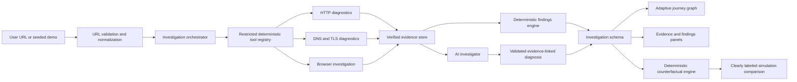

# Packet Journey implementation plan

## Product strategy

Packet Journey will be delivered as ten stable milestones. Each milestone must pass formatting, lint, strict type checking, tests, a production build, and a manual user-flow check before the next begins. Product surfaces may describe later capabilities, but unfinished behavior must be labeled as preview or unavailable.

## Proposed directory structure

```text
PacketJourney/
├── src/
│   ├── app/                    # Application shell, routing, route-level views
│   ├── components/             # Shared presentational components
│   │   ├── icons/
│   │   └── ui/
│   ├── data/                   # Seeded, validated demo investigations
│   ├── features/
│   │   └── investigation/      # Investigation domain UI and state
│   ├── lib/                    # Cross-cutting utilities and validation
│   ├── styles/                 # Design tokens and global styles
│   └── test/                   # Test setup and shared test utilities
│   ├── worker/                 # Layer 3+ Cloudflare Worker entry and services
│   │   ├── diagnostics/        # Small deterministic HTTP diagnostic tools
│   │   ├── findings/           # Evidence-linked deterministic rules
│   │   ├── adapters/           # Diagnostic results to shared investigation schema
│   │   └── security/           # URL, IP, redirect, timeout, and SSRF policy
├── packages/
│   ├── investigation-schema/   # Shared runtime schemas and TypeScript types
│   └── simulation/             # Layer 8 deterministic simulation engine
├── fixtures/                   # Recorded network and browser test fixtures
├── docs/
└── public/
```

Layer 1 keeps shared schemas in `src/features/investigation/schema.ts`. They move into the package boundary when the Worker is introduced, avoiding premature workspace complexity.

## Data flow



In Layer 1, the orchestrator boundary is represented by seeded mock investigations. The interface consumes the same schema intended for live results.

## Layer-by-layer milestone checklist

- [x] Layer 1 — Product foundation
- [x] Layer 2 — Adaptive journey visualization
- [x] Layer 3 — Deterministic HTTP investigation and SSRF-safe fetch
- [ ] Layer 4 — DNS and TLS investigation
- [ ] Layer 5 — Browser investigation
- [ ] Layer 6 — Deterministic findings engine
- [ ] Layer 7 — Evidence-grounded AI investigation
- [ ] Layer 8 — Counterfactual debugging
- [ ] Layer 9 — Persistence and collaboration
- [ ] Layer 10 — Production polish and deployment

## Initial decisions to validate

| Decision           | Initial choice                             | Validation point                                                              |
| ------------------ | ------------------------------------------ | ----------------------------------------------------------------------------- |
| Frontend           | React, Vite, strict TypeScript             | Revisit only if server-rendered marketing content becomes a hard requirement. |
| Routing            | React Router with route-level boundaries   | Validate shareable journey URLs and browser history in Layer 1.               |
| Styling            | Token-driven plain CSS                     | Validate maintainability before adding a CSS framework.                       |
| Visualization      | Accessible custom SVG in Layer 2           | Benchmark complex third-party graphs before rejecting React Flow.             |
| Runtime validation | Zod schemas shared by UI and Worker        | Validate Worker bundle size in Layer 3.                                       |
| Backend            | Cloudflare Worker with small typed tools   | Validate local Worker runtime and outbound API constraints in Layer 3.        |
| Live state         | Durable Object per active investigation    | Validate pricing and hibernation behavior in Layer 9.                         |
| Browser jobs       | Browser Rendering via Queue                | Validate account limits and API availability in Layer 5.                      |
| AI                 | Workers AI through AI Gateway, strict JSON | Validate chosen model's structured-output reliability in Layer 7.             |

## Layer 3 implementation plan

Objective: replace only the ad-hoc live URL fixture path with a versioned Cloudflare Worker API that returns verified HTTP evidence, cautious deterministic findings, and partial failure journeys through the existing canonical `Investigation` contract. Seeded examples remain recorded and unchanged. DNS/TLS inspection, browser execution, persistence, streaming state, and AI remain out of scope.

Likely files:

- `src/worker/index.ts`, `router.ts`, `env.ts`, `errors.ts`, and `logging.ts` for the Worker boundary.
- `src/worker/security/` for canonical URL normalization, IP classification, DNS-over-HTTPS preflight checks, and per-redirect SSRF enforcement.
- `src/worker/diagnostics/` for bounded manual redirects, fixed-header minimal GET requests, header allowlisting, timings, cache analysis, security-header checks, and infrastructure clues.
- `src/worker/findings/` and `src/worker/adapters/` for evidence-linked findings and canonical investigation output.
- `src/features/investigation/api.ts` and the existing URL workspace route for explicit live loading, errors, retry, and recorded/live labeling.
- `wrangler.jsonc`, TypeScript/project scripts, fixtures, and focused unit/integration tests.
- `README.md` and Layer 3 architecture, pipeline, security, runtime, and data-model documentation.

Acceptance criteria:

- `POST /api/v1/investigations/http` validates request and response bodies at runtime and returns no stack traces.
- Only canonical public HTTP(S) targets are accepted; credentials, internal names, disallowed IP ranges, unsafe DNS answers, and unsafe redirect destinations fail closed.
- Every redirect is fetched manually and recorded with status, destination, allowlisted headers, duration, and validation result; loops, missing locations, excess hops, timeouts, and blocked redirects preserve completed evidence.
- Final results include only observable status, URL, allowlisted headers, hop/overall timing, deterministic cache/security analysis, cautious infrastructure clues, and evidence-linked findings.
- The Worker emits the canonical investigation schema without graph coordinates or visualization-library types; the existing graph adapter renders live results unchanged.
- The frontend never silently replaces a failed live request with fixtures and keeps all seven recorded demos available and visibly labeled.
- Formatting, strict TypeScript, zero-warning ESLint, unit/integration/component tests, frontend and Worker production builds, dependency audit, Worker smoke test, and combined development smoke test pass.

Runtime decisions and limits to validate:

- Use an ES-module Worker and the current `wrangler.jsonc` configuration format with separate local/preview/production variables.
- Use `redirect: "manual"`, a fixed safe request header set, per-hop abort timeouts, a bounded overall investigation, and immediate response-body cancellation after headers arrive.
- Use Cloudflare's fixed DNS-over-HTTPS endpoint as a defensive preflight for hostname A/AAAA answers. This can reject observed private answers but cannot pin the subsequent Workers `fetch` connection to those answers, so it reduces rather than eliminates DNS-rebinding risk.
- Report `performance.now()` durations only around Worker subrequests. DNS, TCP, TLS, origin-only, and browser-render timing are unavailable and must not be synthesized.
- Keep the redirect and resolver subrequest budget comfortably below the Workers Free plan limit and avoid parallel open connections beyond runtime limits.

## Risks and runtime limitations

- Browser Rendering, Workers AI, R2, D1, Queues, Durable Objects, and Vectorize require Cloudflare bindings and account credentials. Local deterministic fixtures must remain first-class.
- Workers do not expose arbitrary raw sockets. Low-level TLS details such as cipher suite and full handshake timing may require an external constrained diagnostic service or must be marked unavailable.
- Recursive DNS APIs may omit authoritative traversal details or per-record TTL behavior. Every field must retain its source and collection time.
- Browser resource timing can be incomplete because of cross-origin timing restrictions, cached resources, service workers, and browser API limits.
- Arbitrary URL investigation is an SSRF boundary. Validation must cover every redirect and post-resolution IP, not only the submitted hostname.
- Live websites are unstable test inputs. Recorded fixtures are required for deterministic CI.
- AI is downstream of evidence. Invalid output, unknown evidence IDs, and unsupported causal claims must be rejected or downgraded.
- Large graphs can create accessibility and rendering problems. Layer 2 includes keyboard navigation, reduced motion, clustering, and a non-visual stage list.

## Milestone completion record

Each layer appends its acceptance evidence, commands, known limitations, and manual test notes here before the next starts.

### Layer 1 — Product foundation (complete, 2026-07-16)

Implemented:

- Strict React and TypeScript application scaffold with route-level pages.
- Token-driven dark design system with responsive breakpoints and reduced-motion support.
- Landing page, scenario explorer, URL intake, investigation workspace, and honest future-feature states.
- Runtime-validated investigation, journey stage, evidence, finding, metrics, and artifact schemas.
- Seven seeded scenarios covering cache hits, redirect chains, slow origin, third-party fan-out, TLS failure, missing cache policy, and a labeled simulation preview.
- Selectable journey stages, evidence inspector, expertise modes, stage detail tabs, metrics, findings, and empty/loading/error states.
- Keyboard-operable controls, semantic landmarks, skip navigation, form errors, and mobile navigation.

Validation:

- `npm run format` — passed.
- `npm run typecheck` — passed with strict and unchecked-index rules.
- `npm run lint` — passed with zero warnings.
- `npm run test` — 18 tests passed across four files.
- `npm run build` — passed; 341.92 kB JavaScript / 101.25 kB gzip before the final test-tool-only update.
- `npm audit` — zero production or development vulnerabilities after upgrading Vitest.
- Manual route smoke test — `/`, `/explore`, and `/investigations/redirect-chain` returned HTTP 200 through the Vite development server.

Known limitations:

- All evidence is stable fixture data and is visibly labeled as recorded; no live diagnostics exist yet.
- The Layer 1 journey is a responsive selectable path preview. Zoom, pan, animated packet movement, and true branch layout belong to Layer 2.
- Natural-language commands, sharing, and exports are disabled and labeled with their delivery layers.
- Expertise modes currently change explanatory detail and provenance visibility; deeper protocol fields arrive with live DNS/TLS collection.
- No visual screenshot is committed yet because a browser-rendering test dependency has not been introduced.
- Git was not available in the workspace, so no milestone commit was created.

### Layer 2 — Adaptive journey visualization (complete, 2026-07-16)

Implemented:

- Pure investigation-to-graph adapter with primary/secondary path detection, six relationship types, finding joins, confidence, termination, and bottleneck derivation.
- Stable custom layered layout with no scenario-specific coordinates, overlap tests, malformed-input fallback, and a 50-node/100-edge performance fixture.
- Custom SVG journey canvas with accessible HTML nodes, directed edges, pan, wheel/controls zoom, fit, reset, responsive measurement, and restrained playback signals.
- Distinct visual and textual states for primary/secondary paths, verified/inferred data, warnings, errors, selected/dimmed items, and measured bottlenecks.
- Pointer and keyboard node/edge selection, Escape clearing, directional node traversal, and visible focus states.
- Timeline scrubber, stage skipping, playback, pause, restart, progressive reveal, and graph/timeline synchronization.
- Node and edge evidence inspection with status, timing, raw values, provenance, timestamps, related findings, and expertise-mode depth.
- Corrected fixtures for edge return paths, redirect final URL, TLS termination, and analytics/font/script/image/advertising/support branches.
- Responsive mobile composition and instant reduced-motion playback.
- Headless browser screenshot committed at `docs/assets/journey-visualization.png`.

Validation:

- `npm run format` — passed.
- `npm run typecheck` — passed with strict and unchecked-index rules.
- `npm run lint` — passed with zero warnings.
- `npm run test` — 42 tests passed across seven files.
- `npm run build` — passed; 366.44 kB JavaScript / 108.15 kB gzip and 41.82 kB CSS / 8.84 kB gzip.
- `npm audit` — zero production or development vulnerabilities.
- Development smoke test — landing, explore, empty investigation, and all seven seeded investigation routes returned HTTP 200.
- Manual Chrome review — all seeded shapes, 1440 px desktop, narrow viewport, primary/branch hierarchy, warning/error termination, selection/inspector, and timeline composition checked.
- Automated interaction review — keyboard traversal, Escape, reduced motion, normal playback, graph/timeline synchronization, expertise modes, node/edge selection, and inspector updates passed component tests.

Known limitations:

- Evidence remains fixture-backed; Layer 3 has not started.
- Layout targets directed acyclic request journeys. Cyclic malformed input degrades defensively rather than receiving specialized cycle routing.
- Fit-to-view prioritizes the whole journey; large graphs require zoom for detailed reading. Evidence-based semantic clustering is deferred until browser traces exist.
- Touch gestures use drag pan and explicit zoom controls; multi-touch pinch handling is not yet specialized.
- The compact landing-page preview remains intentionally non-interactive; the investigation workspace is the full central visualization.

### Layer 3 — Deterministic HTTP investigation on Cloudflare Workers (complete, 2026-07-16)

Implemented:

- ES-module Cloudflare Worker, Wrangler local/preview/production configuration, typed environment bindings, Vite API proxy, exact-origin CORS handling, structured logging, request IDs, and runtime API envelopes.
- Canonical URL normalization for HTTP(S), scheme insertion, credential/fragment/port handling, hostname validation, and strict input limits.
- SSRF policy covering internal names, metadata targets, private/loopback/link-local/carrier-grade/reserved/multicast IPv4, IPv6 local/reserved ranges, mapped IPv4 bypasses, and unusual WHATWG IP representations.
- Fail-closed Cloudflare DoH A/AAAA preflight for hostnames plus full destination revalidation on every redirect.
- Minimal fixed-header GET collector with manual redirects, eight-hop bound, loop/missing/invalid/blocked destination handling, per-hop/overall timeouts, monotonic timing, allowlisted header limits, and immediate target-body cancellation.
- Deterministic cache directive analysis, security-header presence checks, cautious infrastructure clues, and schema-validated findings referencing evidence IDs.
- Canonical live journey adapter with explicit redirect stages, evidence-backed edge stages, cache warnings, document-received semantics, and terminal partial-error stages without graph coupling.
- Live frontend loading/progress, structured errors, conditional retry, recorded-example escape routes, live/recorded labeling, and removal of the URL fixture fallback.
- Documentation for the Worker boundary, diagnostics, SSRF defenses, runtime constraints, API lifecycle, environments, deployment, and limitations.

Validation:

- `npm run format` — passed.
- `npm run typecheck` — passed with strict and unchecked-index rules.
- `npm run lint` — passed with zero warnings.
- `npm run test` — 134 tests passed across 19 files.
- `npm run build:web` — passed; 370.90 kB JavaScript / 109.50 kB gzip and 42.22 kB CSS / 8.93 kB gzip.
- `npm run build:worker` — passed; 210.83 kB upload / 39.83 kB gzip with the native rate-limit binding.
- `npm audit` — zero production or development vulnerabilities.
- Local Worker smoke — health 200, loopback rejection 403, public example.com 200, and a real GitHub HTTP→HTTPS redirect completed.
- Combined development smoke — live SPA route 200 and Vite `/api` proxy returned the Worker structured private-target rejection.
- Manual headless Chrome review — live desktop workspace and 500 px narrow recorded workspace checked for graph rendering, evidence labeling, controls, and horizontal containment; a compact-form overflow found during this pass was fixed.
- Mocked integration coverage includes direct success, multiple/relative redirects, loops, missing locations, maximum redirects, blocked redirect, timeout after partial progress, CORS, and no stack leakage.

Known limitations:

- Standard Workers fetch does not expose DNS/TCP/TLS/browser phase timing or resolved peer addresses. Only subrequest and total investigation durations are reported.
- DoH preflight cannot pin the subsequent fetch connection, leaving a documented DNS-rebinding time-of-check/time-of-use gap.
- A cancelled response body means transferred body bytes are unavailable unless the target supplies `Content-Length`; no document contents are retained.
- The native rate-limit binding is a coarse per-location/client-network abuse guard. Exact per-user or organization quotas require the later identity model.
- Targets may block or vary responses to Worker/data-center traffic. Live tests are opt-in; the main suite stays deterministic.
- Layer 4 DNS/TLS collection, Layer 5 browser execution, persistence, streaming, AI, and counterfactuals have not started.
